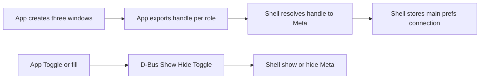

# 0.12 — Shell owns three windows (hide/show)

**Status:** DONE

**Pointer:** `docs/guide-to-writing-plans.md` — **Checklist for plans**; Vala via **`docs/coding-standards-router.md`**. Build: **`docs/build-rules.md`**.

**ℹ️** Supersedes hunting in **`docs/bugs/done/2026-08-01-FIXED-edit-connection-lost-on-hide.md`** (`FloatingCount`, width classify). Builds on three long-lived windows from MainWindow ctor (`connection_editor`, `preferences_editor`, main) plus {@link MainWindow.shell}.

**🔷** Target both **X11 and Wayland** GNOME sessions. Same D-Bus + Shell ownership contract on both; no Wayland-only or X11-only design.

**🔷** Role name for the Guake-style window is **`main`** (not “drop-down” — that means a combo).

---

## Purpose

- **🔷** Exactly **three** app surfaces: **main** (`MainWindow`), Preferences, Connection.
- **🔷** App **exports a handle** per window; Shell resolves that to a Meta window and stores a stable pointer.
- **🔷** Handle format (portal-style):
  - **Wayland** — `wayland:` + xdg-foreign handle (`Gdk.Wayland.Toplevel.export_handle`)
  - **X11** — `x11:` + hex XID (`Gdk.X11.Surface.get_xid`)
- **🔷** Shell show / hide / toggle owns compositor visibility — not GDK `present()` / `visible = false` / unmap hide-on-close.
- **🔷** App may still **`Toggle`** (CLI, media-keys, existing D-Bus callers); implementation calls Shell over D-Bus — no GDK hide/show.
- **🔷** App keeps **content** (`fill()`, Save, jobs, chrome mode).
- **🔷** Remove hunting: `FloatingCount`, width-vs-workArea classify, title matching, scavenger raise loops.
- **🔷** Behaviour and verify on **X11 and Wayland**.
- **ℹ️** About stays `Adw.AboutDialog` on main (not a fourth Shell-owned window).

---

## Current behaviour (pre-0.12)

- **ℹ️** App toggled main with GDK `visible` / `activate` → Meta could go `unmanaged`.
- **ℹ️** Prefs / Connection used `FloatingCount` + width classify (removed in Phase 3).

---

## Proposed behaviour

- **🔷** Startup: create all three (already); each exports its handle; Shell binds and stores; Preferences / Connection start **hidden by Shell** (surfaces stay alive).
- **🔷** Shell keeps `mainWin` / `prefsWin` / `connectionWin` until `unmanaged` (quit) or re-register.
- **🔷** App `DBus.Toggle` / panel / hotkey: Shell `Toggle('main')` on the stored Meta — not GDK visibility.
- **🔷** Open Preferences / Connection: app `fill()` then Shell `Show('preferences'|'connection')`.
- **🔷** Close / Cancel on dialogs: Shell `Hide` that role — no GTK unmap that drops the Meta pointer.

---

## Identity (exported handle)

- **🔷** Roles: `main` | `preferences` | `connection`.
- **🔷** App exports one handle string per role on first `map` (portal-style prefix).
- **🔷** Wayland: `wayland:` + xdg-foreign handle.
- **🔷** X11: `x11:` + hex XID.
- **🔷** `✔️` App → Shell: `Register(s role, s handle)` on `org.roojs.RooTerm.Shell`.
- **🔷** `✔️` Phase 0 landed; Phase 1 retry + startup prime (extension **v34**).
- **🔷** `✔️` {@link MainWindow.shell} holds a {@link GnomeShell} instance; map handlers call `this.shell.register` / `this.window.shell.register` (not a static).
- **ℹ️** X11 resolve: match `Meta.Window.get_description()` (`0x…`) to the hex in `x11:…`.
- **ℹ️** Wayland resolve: Meta GJS has **no** public xdg-foreign → MetaWindow lookup. Phase 0 queues the handle and binds the next unbound RooTerm map (`waylandPending` on `ShellService`).
- **🚫** Title matching, frame-width classify, `FloatingCount` as identity.
- **🚫** Calling the main window “drop-down” in new APIs / slot names / D-Bus roles.
- **🚫** Static `GnomeShell.register`.

### WM class (optional aid)

- **💩** Distinct WM class/instance per window may still help debugging; **handle export is the bind contract**, not class matching.
- **🚫** Relying on WM class alone if handle registration works.

---

## D-Bus contract

### Shell exports

- **🔷** `✔️` Bus `org.roojs.RooTerm.Shell` path `/org/roojs/RooTerm/Shell`:
  - `Register(s role, s handle)` — bind Meta for `main` | `preferences` | `connection`
  - `Show(s role)` / `Hide(s role)` / `Toggle(s role)` — Phase 0 uses **minimize / unminimize** to keep Meta alive
- **🔷** `✅` Show preferences/connection: centre once if needed, `make_above`, raise, activate; main yields above while either dialog is shown.
- **🔷** `✅` Confirm minimize Hide/Show leaves slots intact (no `unmanaged`).

### App D-Bus (`org.roojs.RooTerm.DBus`)

- **🔷** `✔️` `Toggle` **stays** for existing callers; body asks Shell `Toggle('main')` — no `window.visible = false`.
- **🔷** `✔️` Panel may call app `Toggle` or Shell `Toggle('main')` — same end state.
- **🔷** `✔️` `Preferences`: app `fill()` then Shell `Show('preferences')` — no `present()`.
- **🔷** `✔️` Removed property `FloatingCount`.
- **ℹ️** Keep `DockMode`; dock geometry applies to stored `mainWin` when shown.
- **ℹ️** `Quit` / `About` stay on app.

---

## App (GDK) changes

- **🔷** `✔️` {@link GnomeShell.register} on {@link MainWindow.shell} — portal handle + Shell `Register` (`rooterm-shell-handle` for retry).
- **🔷** `✔️` Map call sites: main → `this.shell.register(this, "main")`; prefs/connection → `this.window.shell.register(this, …)`.
- **🔷** `✔️` Meson: `--pkg gtk4-wayland` / `gtk4-x11`.
- **🔷** `✔️` Watch `org.roojs.RooTerm.Shell` and re-`register` all three when the name appears.
- **🔷** `✔️` Startup: `present` prefs + connection, then Shell `Hide` both (surfaces stay mapped/minimized).
- **🔷** `✔️` {@link DBus.call} — shared Shell D-Bus `call_sync` + try/catch (`[DBus (visible = false)]`).
- **🔷** `✔️` `DBus.toggle`: Shell `Toggle('main')` — no GDK `visible` toggle.
- **🔷** `✔️` Prefs / Connection: `fill` + Shell `Show`; open sites no longer `present()`.
- **🔷** `✔️` Dialog `close_request` → Shell `Hide`; `hide_on_close` false; return true (Meta stays).
- **🔷** `✔️` Removed `floating_count` (hooks + property).
- **🚫** Extra show/hide helpers beyond {@link DBus.call} / what the user names.

---

## Extension layout

- **🔷** `✔️` Split modules (PascalCase class files; `extension.js` is the Shell entry name only):
  - `Const.js` — bus ids
  - `Indicator.js` — panel button
  - `ShellService.js` — `Register` / `Show` / `Hide` / `Toggle` + Meta slots
  - `ShellIface.xml` — D-Bus introspection for `wrapJSObject`
  - `Dock.js` — underbar geometry on stored slots
  - `extension.js` — enable/disable wiring
- **🔷** `✔️` `GnomeShell.install` + `gresources.xml` list all of the above.
- **🔷** `✔️` `metadata.json` **v37**.

---

## Extension cleanup

- **🔷** `✔️` Slots: `mainWin` / `prefsWin` / `connectionWin` on `ShellService`; clear on `unmanaged`.
- **🔷** `✔️` Dock / raise / show / hide operate on **stored** pointers only — no classify scan.
- **🔷** `✔️` Deleted width classify, `getFloatingCount`, FloatingCount props subscription, `dropDownWin` alias.
- **🔷** `✔️` Underbar dock geometry on stored `mainWin` when `DockMode` + `Redock` / map on that slot.
- **🚫** New names using `dropDown` / `dropdown` / “drop-down” for roles.

---

## Phases

### Phase 0 — Handle export spike

- **🔷** `✔️` Export `wayland:` / `x11:` handles from main, preferences, connection on first map via {@link MainWindow.shell}.
- **🔷** `✔️` Shell bus + `ShellService` `Register` / `Show` / `Hide` / `Toggle`; X11 resolve by description; Wayland pending-map bind.
- **🔷** `✔️` Extension split into PascalCase modules + `ShellIface.xml`.
- **🔷** `✔️` User verify (X11, 2026-08-02): after Shell reload, `Register` + `stored` for **preferences** and **connection** with `x11:…` handles.
- **🔷** `✔️` **main** missed Register when Shell bus was late — Phase 1 retries via `Bus.watch_name` + stored handle.
- **🔷** `✔️` Closing prefs/connection via Shell `Hide` (Phase 2) — should not `unmanaged cleared slot`.
- **🔷** `✅` Shell `Toggle('main')` Meta-alive check.
- **ℹ️** Vala: `GnomeShell.register` in `src/GnomeShell.vala`; JS: `resources/extension/ShellService.js`.

### Phase 1 — Register three slots at startup

- **🔷** `✔️` Realize / map prefs + connection at startup (`MainWindow` Idle presents both) so all three Register.
- **🔷** `✔️` Shell-hide prefs/connection after prime (inline Shell `Hide` after short timeout; surfaces stay alive via minimize).
- **🔷** `✔️` Wayland pending bind skips tiny frames (`width/height < 400`) so map noise does not steal roles.
- **🔷** `✅` User verify: journal shows `stored role=` for **main**, **preferences**, **connection**; Hide does not `unmanaged cleared slot`.

### Phase 2 — App uses Shell Show / Hide / Toggle

- **🔷** `✔️` {@link DBus.call} for Shell D-Bus methods.
- **🔷** `✔️` App `Toggle` / main close → Shell `Toggle` / `Hide('main')`.
- **🔷** `✔️` Prefs / Connection: `fill` + Shell Show; close → Shell Hide (`hide_on_close` false).
- **🔷** `✔️` Strip GDK visibility toggle for the three (activate docked path uses Shell Show).
- **🔷** `✅` User verify: panel Preferences opens; Cancel/Save leaves slots; Toggle main without `unmanaged`.

### Phase 3 — Remove hunting

- **🔷** `✔️` Remove `FloatingCount` (Vala + JS).
- **🔷** `✔️` Remove classify / scavenger rediscovery; Dock uses registered slots only.
- **🔷** `✔️` Shell `Show` centres dialogs + yields main above; `Hide` restores main above when both dialogs minimized.
- **🔷** `✅` Verify hide/show + dialogs above main.
- **🔷** `✅` Bug **`docs/bugs/done/2026-08-01-FIXED-edit-connection-lost-on-hide.md`**.

---

## LLM notes

- **🚫** Reintroduce title / size / FloatingCount identity.
- **🚫** New Vala helper methods for show/hide without user naming them.
- **🚫** Parenting Preferences/Connection as transient sheets of main (buries on hide).
- **🚫** Wayland-only or X11-only hide/show design (handle **format** differs; **Register/Show/Hide/Toggle** API is shared).
- **🚫** Role or slot name `dropdown` / `drop-down` / `dropDown`.
- **ℹ️** Shell bus is `org.roojs.RooTerm.Shell` (Phase 0).
- **ℹ️** Hide uses **minimize** (keeps Meta alive). Main: slide + opacity, then minimize with ``skipNextEffect``.
- **ℹ️** Permanent ``skip_taskbar`` blocks Mutter minimize. Bracket: clear → minimize → set again. GNOME 48 X11: app D-Bus ``SkipTaskbar``; 49+: ``show_in_window_list`` / ``hide_from_window_list``. Async only (no ``call_sync`` from Shell).
- **🚫** Hide via ``actor.hide`` / ``lower`` / park / wmctrl — paint-only; input stays / unstable.
