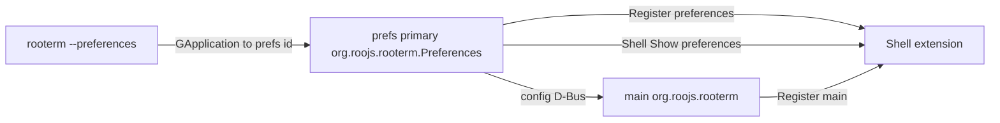

# 0.15 — Preferences process; Shell owns main (+ prefs by app id)

**Status:** proposed

**Pointer:** `docs/guide-to-writing-plans.md` — **Checklist for plans**; Vala via **`docs/coding-standards-router.md`**. Build: **`docs/build-rules.md`**.

**ℹ️** Draft plan from chat. **🔷** = words Alan said. Everything else is **💩** / **ℹ️** / **🚫** until he promotes it.

---

## Purpose (user said)

- **🔷** Shell still has to manage Preferences — it has to stay on top of the main window.
- **🔷** Preferences is its **own process**.
- **🔷** Different **application id**: `org.roojs.rooterm.Preferences` (RooTerm Preferences); agreed.
- **🔷** **Same binary**.
- **🔷** Separate **`--preferences`** launch (not the same treatment for edit-connection).
- **🔷** Second (and later) `--preferences`: session D-Bus goes to the **already-running Preferences app** (not main); that app brings the window forward.
- **🔷** The **Preferences app** is what fires up / shows the preferences window; it then asks **Shell** to `Show` it (stacking above main).
- **🔷** First launch: process starts, creates window, Register, Shell Show — correct.
- **🔷** Main / panel Preferences: start or activate that same prefs app (same path as CLI) — correct.
- **🔷** Keep Shell **`Register` for both** preferences and main (role argument already on Register).
- **🔷** Handle format stays as today (`x11:` / `wayland:`).
- **🔷** Connection: **no** Register (as far as we know so far). Drop the connection Shell role. Connection editing does not need its own window; only while main is visible; hiding main should hide connection too. Parent on main.
- **🔷** Phase 0 (connection off Shell) — yes.
- **🔷** **Split** settings vs host tree (two things). One-time change OK (office + here).
- **🔷** Keep **`connections.json`** for the tree / connections.
- **🔷** Settings file name: prefer **`config`** (not “settings”).
- **🔷** Class side is already conceptually split; it’s mainly **loading / saving** two files.
- **🔷** Not config reload (as the prefs↔main sync design).
- **🔷** Front end is a thin view: on appear load config from disk; on change it may update local data but **must** send via D-Bus; main / backend **writes** and **applies**.
- **🔷** Do **not** grow a D-Bus method per preferences field. Prefer typed methods (string, int, …) **or** name + config object — whichever is simpler.
- **🔷** Serializing Config without the tree remains a D-Bus option.
- **🔷** Migration: **not** a version field in the file. Load config; if a **tree** is present there, do **not** load it into config — hand off to **migration** code that reloads and **splits** the files. Migration can be a **separate class**, trash it later when unused.
- **🔷** Property / config D-Bus starts simple and will get more complicated later.
- **🔷** Phase it in.
- **🔷** No workaround that guesses names, ordering, or the like.

---

## Agreed launch / show path



- **🔷** App id `org.roojs.rooterm.Preferences`.
- **🔷** CLI `--preferences` → Preferences app (start or activate) → Shell Show.
- **🔷** First launch and main/panel Preferences — same prefs-app path.
- **🚫** Forward `--preferences` into **main**’s application id.
- **🚫** `ReloadConfig` / whole-file reread as prefs↔main sync.
- **🚫** Title / FIFO / size identity.
- **🚫** `--edit-connection` as its own app.
- **🚫** One D-Bus method per preferences field.
- **🚫** Version-property migration (`version == 1` migrate / `version == 2` skip) — rejected in favour of tree-present → migrate class.

---

## Config vs connections files

- **🔷** `connections.json` — host tree / connections (keep the name).
- **🔷** `config` — chrome / preferences settings (Alan prefers this name over “settings”).
- **💩** Exact path/filename on disk: **`config.json`** (proposed in Phase 1 fences) next to `connections.json`.
- **ℹ️** Today one file `connections.json` holds chrome fields + **flat** `connections` array (`src/Config.vala`).
- **🔷** Split is mostly load/save; class fields are already separable.
- **🔷** Two deployments already using the combined file — one-time migrate is fine.
- **🔷** Host I/O on **`TreeNodes`**: load builds the tree; save writes the **tree** (not the silly flat dump).
- **🔷** Migrate once from original flat → tree file; thereafter only tree load/save.

### Migration (no version field)

- **🔷** Load config as normal; if `connections` present, ignore them and set `need_migrate`.
- **🔷** If flagged, migration handles the connections; separate class; trash later.
- **🔷** Migrate loads the **original flat** list, **builds a tree**, then **`TreeNodes.save`** writes that tree; from then on only tree load/save.
- **💩** Because {@link Config.load} is static, it relays to {@link ConfigMigrate.run} when the flag is set (callers unchanged).
- **🔷** Future **`save()`** does not write `connections` into `config.json`; hosts via {@link Host.TreeNodes.save}.
- **🚫** Version-field migration; paths on the instance; stashing `connections` JSON on the config; flat `by_uuid` dump as the ongoing hosts format; invented `Connections` class.

---

## D-Bus config change — still choosing

- **🔷** Typed setters (string / int / …) **or** name + config object — pick simpler.
- **🔷** Serialized Config **without tree** still a candidate (fits the split).
- **💩** After split, prefs only ever reads/writes **`config`**; D-Bus payload is chrome-only.

---

## Shell Register

- **🔷** Register for **main** and **preferences**; handle format unchanged.
- **🔷** Connection: no Register.

---

## Current behaviour (short)

- **ℹ️** One process, three Shell roles: `main` / `preferences` / `connection` (connection role already dropped in Phase 0).
- **ℹ️** Single `connections.json` with chrome + **flat** `connections` array (`parent_uuid`); live tree rebuilt on load (`src/Config.vala`).
- **ℹ️** Wayland bind pain: **`docs/bugs/2026-08-02-wayland-g48-handoff-role-scramble.md`**.

---

## Phases (task breakdown is 💩 unless noted)

### Phase 0 — Connection off Shell

- **🔷** Yes — drop connection Shell role; hide connection when main hides.
- **🔷** Parent connection on main (`transient_for`).
- **✔️** Remove `Register` / `Show` / `Hide('connection')`; GTK `present` / `hide_on_close`; no startup Shell prime for connection; hide with main on Toggle / main Hide; Shell slots dropped (extension **v84**).
- **⏳** User verify: edit connection; hide main leaves no stranded Connection.

### Phase 1 — Split `config` / `connections.json` + tree on `TreeNodes` + migration

- **🔷** Load config as normal — if JSON has `connections`, ignore them and set `need_migrate`; if flagged, migration handles connections.
- **🔷** **`TreeNodes.load` / `save`** — load builds the tree; save writes the **tree** (not the flat list).
- **🔷** Migrate: original flat → build tree → save tree; thereafter only tree I/O.
- **💩** `Config.load` calls `ConfigMigrate.run` when `need_migrate`, else `Host.TreeNodes.load(config)` — callers stay `Config.load()` only.
- **🔷** Future config `save` does not write `connections` into `config.json` (`tree.save` writes hosts).
- **💩** Settings file: **`config.json`**.
- **💩** Hosts file shape: JSON **array of root** {@link Host.Connection} with nested **`children`** (Connection starts serializing children).
- **🚫** `Json.Parser`; stashing connections; invented `Connections` type; ongoing flat `by_uuid` → `connections` array save; paths on the instance.
- **💩** Read/write via `get_contents` / `set_contents` + `Json.gobject_from_data` / `gobject_to_data` / `Json.from_string` / `to_string` as needed.
- **💩** `⏳` Code below — implement after review.
- **⏳** User verify: one-time upgrade; Shell reads `config.json` for toggle-key / placement.

Edits are **Remove** / **Replace with** / **Add** from the tree; verify surrounding context before applying.

**Flow**

```
config = Config.load();
// inside load:
//   if (need_migrate) ConfigMigrate.run(config);  // flat → tree → TreeNodes.save
//   else Host.TreeNodes.load(config);             // nested JSON → live tree + by_uuid
```

---

### 1. `src/Config.vala` — `need_migrate` flag only; drop ``path``

**Why:** Deserialize only sets the flag. Load / migrate re-reads for hosts. Fixed paths — not instance state.

**Where:** class doc; remove `path`; add `need_migrate` before `pending_secrets`.

**Depends on:** none.

#### Remove
```vala
	/**
	 * RooTerm ``connections.json``: load/save and one-shot Ásbrú import.
	 */
	public class Config : Object, Json.Serializable
	{
```

#### Replace with
```vala
	/**
	 * RooTerm settings in ``config.json`` (hosts via {@link Host.TreeNodes}).
	 */
	public class Config : Object, Json.Serializable
	{
```

#### Remove
```vala
		public string path { get; set; default = ""; }
		/**
		 * uuid → password from Ásbrú import; drained by {@link store_pending_secrets}.
		 * Not serialized.
		 */
		public Gee.HashMap<string, string> pending_secrets {
```

#### Replace with
```vala
		/**
		 * True when settings JSON contained ``connections`` — {@link Config.load} runs {@link ConfigMigrate}.
		 * Not serialized.
		 */
		public bool need_migrate { get; set; default = false; }
		/**
		 * uuid → password from Ásbrú import; drained by {@link store_pending_secrets}.
		 * Not serialized.
		 */
		public Gee.HashMap<string, string> pending_secrets {
```

---

### 2. `src/Config.vala` — deserialize: ignore `connections`, set flag; serialize: omit them

**Why:** Load as normal — on `connections`, only set `need_migrate` (do not keep the JSON). Migrate re-reads the file for the flat list.

**Where:** `serialize_property` / `deserialize_property` `connections` cases.

**Depends on:** §1.

#### Remove — `serialize_property` switch body (skip list + connections)
```vala
			switch (property_name) {
				case "by-uuid":
				case "tree":
				case "path":
				case "pending-secrets":
					return null;
				case "connections":
					var arr = new Json.Array();
					foreach (var conn in this.connections) {
						arr.add_element(Json.gobject_serialize(conn));
					}
					var node = new Json.Node(Json.NodeType.ARRAY);
					node.take_array(arr);
					return node;
				default:
					return default_serialize_property(property_name, value, pspec);
			}
```

#### Replace with
```vala
			switch (property_name) {
				case "by-uuid":
				case "tree":
				case "connections":
				case "pending-secrets":
				case "need-migrate":
					return null;
				default:
					return default_serialize_property(property_name, value, pspec);
			}
```

#### Remove — `deserialize_property` `connections` case
```vala
				case "connections":
					this.connections.clear();
					if (property_node.get_node_type() == Json.NodeType.ARRAY) {
						var json_array = property_node.get_array();
						for (var i = 0; i < json_array.get_length(); i++) {
							var conn = Json.gobject_deserialize(typeof(Host.Connection), json_array.get_element(i)) as Host.Connection;
							if (conn == null) {
								continue;
							}
							this.connections.add(conn);
						}
					}
					value = Value(typeof(Gee.ArrayList));
					value.set_object(this.connections);
					return true;
```

#### Replace with
```vala
				case "connections":
					this.need_migrate = true;
					value = Value(typeof(Gee.ArrayList));
					value.set_object(this.connections);
					return true;
```

---

### 3. `src/Host/Connection.vala` — serialize nested ``children``

**Why:** **🔷** Hosts file is a **tree**; nest must round-trip. Today `children` is skipped (flat + `parent_uuid` rebuild).

**Where:** `serialize_property` / `deserialize_property`.

**Depends on:** none.

#### Remove — skip `children` in serialize
```vala
				case "pass":
				case "passphrase":
				case "sessions":
				case "children":
				case "parent":
```

#### Replace with
```vala
				case "pass":
				case "passphrase":
				case "sessions":
				case "parent":
```

#### Add — serialize `children` (before `default` / after `forwards`)
```vala
				case "children":
					var arr = new Json.Array();
					foreach (var child in this.children) {
						arr.add_element(Json.gobject_serialize(child));
					}
					var node = new Json.Node(Json.NodeType.ARRAY);
					node.take_array(arr);
					return node;
```

#### Add — deserialize `children`
```vala
				case "children":
					var kids = new Host.TreeNodes();
					if (property_node.get_node_type() == Json.NodeType.ARRAY) {
						var json_array = property_node.get_array();
						for (var i = 0; i < json_array.get_length(); i++) {
							var child = Json.gobject_deserialize(typeof(Connection), json_array.get_element(i)) as Connection;
							if (child == null) {
								continue;
							}
							kids.items_add_for_json(child); // 💩 name — use whatever append-without-flat gateway fits load
						}
					}
					this.children = kids;
					value = Value(typeof(Host.TreeNodes));
					value.set_object(this.children);
					return true;
```

**💩** Exact helper for “add child during JSON load without double-counting flat” — wire in §4.

---

### 4. `src/Host/TreeNodes.vala` — `load` builds tree; `save` writes tree

**Why:** **🔷** Backing store for the host list owns host I/O. Load builds the tree; save persists the tree (not flat).

**Where:** end of `TreeNodes` class.

**Depends on:** §3.

#### Add
```vala
		/**
		 * Load ``~/.config/rooterm/connections.json`` as a nested tree into ``config``.
		 * File is a JSON array of root {@link Connection} (each with nested ``children``).
		 *
		 * @param config Owning config (fills ``tree`` / ``by_uuid`` / ``flat``)
		 * @throws GLib.Error On read / parse failure
		 */
		public static void load(RooTerm.Config config) throws GLib.Error
		{
			var path = GLib.Path.build_filename(
				GLib.Environment.get_home_dir(), ".config", "rooterm", "connections.json"
			);
			config.tree.config = config;
			if (!GLib.FileUtils.test(path, GLib.FileTest.IS_REGULAR)) {
				return;
			}
			string contents;
			GLib.FileUtils.get_contents(path, out contents);
			var root = Json.from_string(contents);
			if (root == null || root.get_node_type() != Json.NodeType.ARRAY) {
				throw new GLib.IOError.INVALID_DATA("connections.json root is not an array");
			}
			var json_array = root.get_array();
			for (var i = 0; i < json_array.get_length(); i++) {
				var conn = Json.gobject_deserialize(typeof(Connection), json_array.get_element(i)) as Connection;
				if (conn == null) {
					continue;
				}
				config.tree.adopt_subtree(null, conn); // 💩 wires parent / by_uuid / flat recursively
			}
			config.tree.sort((a, b) => {
				return a.name.collate(b.name);
			});
			GLib.debug("loaded connections=%d roots=%d",
				config.by_uuid.size, config.tree.size);
		}

		/**
		 * Write ``connections.json`` as nested roots (no passwords).
		 */
		public void save()
		{
			var path = GLib.Path.build_filename(
				GLib.Environment.get_home_dir(), ".config", "rooterm", "connections.json"
			);
			var arr = new Json.Array();
			foreach (var conn in this) {
				arr.add_element(Json.gobject_serialize(conn));
			}
			var node = new Json.Node(Json.NodeType.ARRAY);
			node.take_array(arr);
			try {
				GLib.FileUtils.set_contents(path, Json.to_string(node, true));
			} catch (GLib.Error e) {
				GLib.warning("connections save failed: %s", e.message);
			}
		}
```

**💩** `adopt_subtree` / load-time child attach — implement beside `append` so nested deserialize + flat stay consistent (skip deleted / `LOCAL_PATH` as today).

---

### 5. `src/Config.vala` — `load()`: migrate or `TreeNodes.load`

**Why:** Still one `load()`. After deserialize, if `need_migrate` relay; otherwise {@link Host.TreeNodes.load}.

**Where:** top of `load()` through return.

**Depends on:** §2, §4.

#### Remove — path / parser / flat rebuild body of `load()`
*(whole method body after `create_with_parents` through return — replace as below)*

#### Replace with
```vala
			var path = GLib.Path.build_filename(dir, "connections.json");
			var config_path = GLib.Path.build_filename(dir, "config.json");

			if (!GLib.FileUtils.test(config_path, GLib.FileTest.IS_REGULAR)
					&& !GLib.FileUtils.test(path, GLib.FileTest.IS_REGULAR)) {
				var asbru = new Asbru.Config();
				asbru.load();
				var config = asbru.to_config();
				config.save();
				GLib.debug("imported asbru connections=%d roots=%d",
					config.by_uuid.size, config.tree.size);
				return config;
			}

			var open_path = GLib.FileUtils.test(config_path, GLib.FileTest.IS_REGULAR)
				? config_path : path;
			string contents;
			GLib.FileUtils.get_contents(open_path, out contents);
			var config = (Config) Json.gobject_from_data(typeof(Config), contents);
			if (config.need_migrate) {
				ConfigMigrate.run(config);
				return config;
			}
			Host.TreeNodes.load(config);
			return config;
```

**💩** Ásbrú import still builds a live tree then `save()` → nested `connections.json` + `config.json` (no flat file).

---

### 6. `src/ConfigMigrate.vala` — flat → tree → `TreeNodes.save`

**Why:** **🔷** One-shot: re-read original flat `connections`, build tree, save tree, write clean `config.json`.

**Where:** new file; `meson.build` after `'src/Config.vala',`.

**Depends on:** §2, §4.

#### Add — new file `src/ConfigMigrate.vala`

```vala
/*
 * Copyright (C) 2026 Alan Knowles <alan@roojs.com>
 *
 * This library is free software; you can redistribute it and/or
 * modify it under the terms of the GNU Lesser General Public
 * License as published by the Free Software Foundation; either
 * version 3 of the License, or (at your option) any later version.
 *
 * This library is distributed in the hope that it will be useful,
 * but WITHOUT ANY WARRANTY; without even the implied warranty of
 * MERCHANTABILITY or FITNESS FOR A PARTICULAR PURPOSE.  See the GNU
 * Lesser General Public License for more details.
 *
 * You should have received a copy of the GNU Lesser General Public License
 * along with this library; if not, write to the Free Software Foundation,
 * Inc., 51 Franklin Street, Fifth Floor, Boston, MA  02110-1301  USA
 */

namespace RooTerm
{
	/**
	 * One-shot: re-read settings JSON that still has flat ``connections``,
	 * build the live tree, write nested ``connections.json`` + clean ``config.json``.
	 * Trash when unused.
	 *
	 * == Example ==
	 *
	 * {{{
	 * if (config.need_migrate) {
	 *     ConfigMigrate.run(config);
	 * }
	 * }}}
	 */
	public class ConfigMigrate
	{
		/**
		 * Flat list → tree → {@link Host.TreeNodes.save}; chrome → ``config.json``.
		 *
		 * @param config Flagged instance from {@link Config.load}
		 * @throws GLib.Error On read / write failure
		 */
		public static void run(Config config) throws GLib.Error
		{
			var dir = GLib.Path.build_filename(
				GLib.Environment.get_home_dir(), ".config", "rooterm"
			);
			var connections_path = GLib.Path.build_filename(dir, "connections.json");
			var config_path = GLib.Path.build_filename(dir, "config.json");
			var open_path = GLib.FileUtils.test(config_path, GLib.FileTest.IS_REGULAR)
				? config_path : connections_path;
			string contents;
			GLib.FileUtils.get_contents(open_path, out contents);
			var root = Json.from_string(contents);
			if (root == null || root.get_node_type() != Json.NodeType.OBJECT) {
				throw new GLib.IOError.INVALID_DATA("migrate: root is not an object");
			}
			var obj = root.get_object();
			var connections_node = obj.get_member("connections");
			obj.remove_member("connections");

			config.tree.config = config;
			var flat = new Gee.ArrayList<Host.Connection>();
			if (connections_node != null
					&& connections_node.get_node_type() == Json.NodeType.ARRAY) {
				var json_array = connections_node.get_array();
				for (var i = 0; i < json_array.get_length(); i++) {
					var conn = Json.gobject_deserialize(typeof(Host.Connection), json_array.get_element(i)) as Host.Connection;
					if (conn == null || conn.uuid.length == 0) {
						continue;
					}
					conn.children = new Host.TreeNodes();
					flat.add(conn);
					config.by_uuid.set(conn.uuid, conn);
				}
			}
			foreach (var conn in flat) {
				if (conn.deleted) {
					continue;
				}
				if (conn.kind == Host.ConnectionKind.LOCAL_PATH) {
					continue;
				}
				Host.Connection? parent = null;
				if (conn.parent_uuid.length > 0 && conn.parent_uuid != "__PAC__ROOT__"
					&& config.by_uuid.has_key(conn.parent_uuid)) {
					parent = config.by_uuid.get(conn.parent_uuid);
					if (parent.deleted) {
						parent = null;
					}
				}
				config.tree.append(parent, conn);
			}
			config.tree.sort((a, b) => {
				return a.name.collate(b.name);
			});
			foreach (var conn in config.by_uuid.values) {
				conn.children.sort((a, b) => {
					return a.name.collate(b.name);
				});
			}

			config.need_migrate = false;
			config.tree.save();
			GLib.FileUtils.set_contents(config_path, Json.to_string(root, true));
			GLib.debug("migrated flat → tree connections=%d roots=%d",
				config.by_uuid.size, config.tree.size);
		}
	}
}
```

#### Add — `meson.build` after `'src/Config.vala',`

```meson
    'src/ConfigMigrate.vala',
```

---

### 7. `src/Config.vala` — `save()`: chrome file + `tree.save`

**Why:** **🔷** `config.json` never gets `connections`; hosts only as nested tree in `connections.json`.

**Where:** `save()`.

**Depends on:** §2, §4.

#### Remove
```vala
		public void save()
		{
			this.connections.clear();
			var ordered = new Gee.ArrayList<Host.Connection>();
			foreach (var conn in this.by_uuid.values) {
				ordered.add(conn);
			}
			ordered.sort((a, b) => {
				return a.name.collate(b.name);
			});
			foreach (var conn in ordered) {
				this.connections.add(conn);
			}
			var generator = new Json.Generator();
			generator.set_root(Json.gobject_serialize(this));
			generator.pretty = true;
			generator.indent = 2;
			try {
				generator.to_file(this.path);
			} catch (GLib.Error e) {
				GLib.warning("config save failed: %s", e.message);
				return;
			}
			GLib.debug("saved connections=%d to %s", this.by_uuid.size, this.path);
		}
```

#### Replace with
```vala
		public void save()
		{
			var config_path = GLib.Path.build_filename(
				GLib.Environment.get_home_dir(), ".config", "rooterm", "config.json"
			);
			try {
				GLib.FileUtils.set_contents(
					config_path, Json.gobject_to_data(this, null)
				);
			} catch (GLib.Error e) {
				GLib.warning("config save failed: %s", e.message);
				return;
			}
			this.tree.save();
			GLib.debug("saved connections=%d", this.by_uuid.size);
		}
```

---

### 8. Shell — read settings from `config.json`

**Why:** toggle-key / placement live in settings after split.

**Where:** `Dock.js` `dockMain`; `extension.js` tooltip.

#### Remove — both files (same path string)
```javascript
                GLib.get_home_dir(), '.config', 'rooterm', 'connections.json',
```

#### Replace with
```javascript
                GLib.get_home_dir(), '.config', 'rooterm', 'config.json',
```

Bump `metadata.json` version after copy.

---

### Phase 2 — Prefs process + Register both

- **🔷** Own process; id `org.roojs.rooterm.Preferences`; same binary; `--preferences` / panel → prefs app → Shell Show; Register main and preferences; handle format same.
- **💩** `⏳` Wire app id + CLI; desktop/meson if needed; remove in-process prefs Shell prime; verify first launch, second CLI, panel.

### Phase 3 — Config D-Bus (not reload; not per-field methods)

- **🔷** Thin view loads **`config`** from disk; D-Bus on change; main writes + applies; typed **or** name+config / serialize without tree.
- **💩** `⏳` Implement chosen D-Bus shape; wire current prefs fields; verify opacity on main.
- **🚫** Config reload sync path.
- **🚫** One D-Bus method per field.

### Phase 4 — Cleanup

- **💩** `⏳` Strip connection Shell leftovers; strip FIFO/title-match bind; bump extension version; point 0.12 / bug doc at this contract.
- **🚫** Leaving guessing identity in place.

---

## D-Bus sketch

### Shell (`org.roojs.RooTerm.Shell`)

- **🔷** `Register(role, handle)` for **main** and **preferences** (handle format unchanged).
- **💩** `Show` / `Hide` / `Toggle` as needed for stacking and visibility.

### App main (`org.roojs.RooTerm.DBus`)

- **🔷** Accept config updates from prefs; write + apply (shape TBD).
- **🔷** Panel Preferences → start/activate prefs app; prefs asks Shell Show.
- **🚫** `ReloadConfig` / bulk reload sync.
- **🚫** One method per preferences field.

### Prefs process (`org.roojs.rooterm.Preferences`)

- **🔷** Show path → Shell `Show('preferences')`; thin view; load **`config`** on appear; D-Bus on change; Register preferences.
- **💩** Own bus name optional beyond GApplication.
- **🚫** Drop-down `Toggle` on prefs.

---

## Suggested order (💩)

1. Phase 0 — connection off Shell (**🔷**).
2. Phase 1 — file split + migration class (**🔷**).
3. Phase 2 — prefs process + Register both (**🔷**).
4. Phase 3 — config D-Bus after picking typed vs name+object (**🔷** options).
5. Phase 4 — cleanup (**💩**).

---

## Open decisions (need Alan)

1. **🔷** D-Bus shape: typed setters vs name + config object vs serialized Config without tree — which is simpler.

---

## LLM notes

- **🔷** only for things Alan explicitly said; do not “upgrade” **💩** after paraphrasing.
- **🚫** Config reload sync; version-field migration; guessing names/ordering; `--edit-connection` app; unnamed new Vala helpers; Shell `Register` for connection; one D-Bus method per prefs field; invented `Connections` class; ongoing flat hosts save.
- **ℹ️** Coding standards / router when implementing Vala.
)
