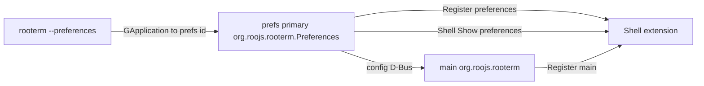

# 0.15 — Preferences process; Shell owns main (+ prefs by app id)

**Status:** proposed — Phases 0–2 implemented; remaining work in **`docs/plans/0.15.1-prefs-process-dbus-cleanup.md`**.

**Pointer:** `docs/guide-to-writing-plans.md` — **Checklist for plans**; Vala via **`docs/coding-standards-router.md`**. Build: **`docs/build-rules.md`**.

**ℹ️** Draft plan from chat. **🔷** = words Alan said. Everything else is **💩** / **ℹ️** / **🚫** until he promotes it.

**➡️** Prefs process, ConfigUpdate D-Bus, save split, cleanup → **[0.15.1](0.15.1-prefs-process-dbus-cleanup.md)**.

---

## Purpose (user said)

- **🔷** Shell still has to manage Preferences — it has to stay on top of the main window.
- **🔷** Preferences is its **own process**.
- **🔷** Different **application id**: `org.roojs.rooterm.Preferences` (RooTerm Preferences); agreed.
- **🔷** **Same binary**.
- **🔷** Separate **`--preferences`** launch (not the same treatment for edit-connection).
- **🔷** Second (and later) `--preferences`: session D-Bus goes to the **already-running Preferences app** (not main); that app brings the window forward.
- **🔷** The **Preferences app** is what fires up / shows the preferences window; it then asks **Shell** to `Show` it (stacking above main).
- **🔷** First launch: process starts, creates window, Register, Shell Show — correct.
- **🔷** Main / panel Preferences: start or activate that same prefs app (same path as CLI) — correct.
- **🔷** Keep Shell **`Register` for both** preferences and main (role argument already on Register).
- **🔷** Handle format stays as today (`x11:` / `wayland:`).
- **🔷** Connection: **no** Register (as far as we know so far). Drop the connection Shell role. Connection editing does not need its own window; only while main is visible; hiding main should hide connection too. Parent on main.
- **🔷** Phase 0 (connection off Shell) — yes.
- **🔷** **Split** settings vs host tree (two things). One-time change OK (office + here).
- **🔷** Keep **`connections.json`** for the tree / connections.
- **🔷** Settings file name: prefer **`config`** (not “settings”).
- **🔷** Class side is already conceptually split; it’s mainly **loading / saving** two files.
- **🔷** Not config reload (as the prefs↔main sync design).
- **🔷** Front end is a thin view: on **display**, load / rebuild **`config`** from disk (it may have changed). Prefs **may read**; **must not write**. On change: update local UI data if needed, send **`ConfigUpdate(key, string)`** via D-Bus; **main** writes and applies.
- **🔷** Do **not** grow a D-Bus method per preferences field.
- **🔷** Config update D-Bus: **key + string value only** (not polymorphic). Sender always sends a string; receiver converts back (switch — many fields ints).
- **🚫** Typed setters per type; serialize whole Config (with or without tree) as the sync payload.
- **🔷** Migration: **not** a version field in the file. Load config; if a **tree** is present there, do **not** load it into config — hand off to **migration** code that reloads and **splits** the files. Migration can be a **separate class**, trash it later when unused.
- **🔷** Property / config D-Bus starts simple and will get more complicated later.
- **🔷** Phase it in.
- **🔷** No workaround that guesses names, ordering, or the like.

---

## Agreed launch / show path



- **🔷** App id `org.roojs.rooterm.Preferences`.
- **🔷** CLI `--preferences` → Preferences app (start or activate) → Shell Show.
- **🔷** First launch and main/panel Preferences — same prefs-app path.
- **🚫** Forward `--preferences` into **main**’s application id.
- **🚫** `ReloadConfig` / whole-file reread as prefs↔main sync.
- **🚫** Title / FIFO / size identity.
- **🚫** `--edit-connection` as its own app.
- **🚫** One D-Bus method per preferences field.
- **🚫** Version-property migration (`version == 1` migrate / `version == 2` skip) — rejected in favour of tree-present → migrate class.

---

## Config vs connections files

- **🔷** `connections.json` — host tree / connections (keep the name).
- **🔷** `config` — chrome / preferences settings (Alan prefers this name over “settings”).
- **💩** Exact path/filename on disk: **`config.json`** (proposed in Phase 1 fences) next to `connections.json`.
- **ℹ️** Today one file `connections.json` holds chrome fields + **flat** `connections` array (`src/Config.vala`).
- **🔷** Split is mostly load/save; class fields are already separable.
- **🔷** Two deployments already using the combined file — one-time migrate is fine.
- **🔷** Host I/O on **`TreeNodes`**: **`new Host.TreeNodes.from_json`** builds the tree; save writes the **tree** (not the silly flat dump). **No `to_json`**.
- **🔷** Migrate once from original flat → tree file; thereafter only tree load/save.
- **🚫** Invented `Connections` class; `TreeNodes.to_json`.

### Migration (no version field)

- **🔷** Load config as normal; if `connections` present, ignore them and set `need_migrate`.
- **🔷** If flagged, migration handles the connections; separate class; trash later.
- **🔷** Migrate loads the **original flat** list, **builds a tree**, then **`TreeNodes.save`** writes that tree; from then on only tree load/save.
- **💩** Because {@link Config.load} is static, it relays to {@link ConfigMigrate.run} when the flag is set (callers unchanged).
- **🔷** Future **`save()`** does not write `connections` into `config.json`; hosts via {@link Host.TreeNodes.save}.
- **🚫** Version-field migration; paths on the instance; stashing `connections` JSON on the config; flat `by_uuid` dump as the ongoing hosts format; invented `Connections` class.

---

## D-Bus config change

- **🔷** Simple: **`ConfigUpdate(key, value)`** — `value` is **always a string** (not polymorphic).
- **🔷** Sender: format as string; receiver: convert back (switch on key; many are ints).
- **🔷** Prefs: **read** `config.json` on display (reload / rebuild — may have changed). **No writes** from prefs.
- **🔷** Main: sole writer of `config.json` + apply live.
- **🚫** One D-Bus method per field; typed/variant value; serialize whole Config down the wire; prefs calling `Config.save`.

---

## Shell Register

- **🔷** Register for **main** and **preferences**; handle format unchanged.
- **🔷** Connection: no Register.

---

## Current behaviour (short)

- **ℹ️** One process, three Shell roles: `main` / `preferences` / `connection` (connection role already dropped in Phase 0).
- **ℹ️** Single `connections.json` with chrome + **flat** `connections` array (`parent_uuid`); live tree rebuilt on load (`src/Config.vala`).
- **ℹ️** Wayland bind pain: **`docs/bugs/2026-08-02-wayland-g48-handoff-role-scramble.md`**.

---

## Phases (task breakdown is 💩 unless noted)

### Phase 0 — Connection off Shell

- **🔷** Yes — drop connection Shell role; hide connection when main hides.
- **🔷** Parent connection on main (`transient_for`).
- **✔️** Remove `Register` / `Show` / `Hide('connection')`; GTK `present` / `hide_on_close`; no startup Shell prime for connection; hide with main on Toggle / main Hide; Shell slots dropped (extension **v84**).
- **⏳** User verify: edit connection; hide main leaves no stranded Connection.

### Phase 1 — Split `config` / `connections.json` + tree on `TreeNodes` + migration

- **🔷** Load config as normal — if JSON has `connections`, ignore them and set `need_migrate`; if flagged, migration handles connections.
- **🔷** **`TreeNodes` helpers** — named ctor **`new Host.TreeNodes.from_json`**; **no `to_json`** (save keeps nested serialize).
- **🔷** Load builds the tree via `from_json`; save writes the **tree** (not the flat list).
- **🔷** Migrate: original flat → build tree → save tree; thereafter only tree I/O.
- **💩** `Config.load` calls `ConfigMigrate.run` when `need_migrate`, else read hosts file → `new Host.TreeNodes.from_json` into `config.tree` — callers stay `Config.load()` only.
- **🔷** Future config `save` does not write `connections` into `config.json` (`tree.save` writes hosts).
- **💩** Settings file: **`config.json`**.
- **💩** Hosts file shape: JSON **array of root** {@link Host.Connection} with nested **`children`** (Connection starts serializing children).
- **🚫** `Json.Parser`; stashing connections; invented `Connections` type; ongoing flat `by_uuid` → `connections` array save; paths on the instance.
- **💩** Read/write via `get_contents` / `set_contents` + `Json.gobject_from_data` / `gobject_to_data` / `Json.from_string` / `to_string` as needed.
- **💩** `✔️` Code below — implemented from fences.
- **⏳** User verify: one-time upgrade; Shell reads `config.json` for toggle-key / placement.
- **ℹ️** Steady-state nest load: `from_json` currently uses ``items.add`` (bypasses ``append``) — **Phase 2**.

Edits are **Remove** / **Replace with** / **Add** from the tree; verify surrounding context before applying.

**Flow**

```
config = Config.load();
// inside load:
//   if (need_migrate) ConfigMigrate.run(config);  // flat → tree → tree.save()
//   else config.tree = new Host.TreeNodes.from_json(…);  // nested JSON → live tree
```

---

### 1. `src/Config.vala` — `need_migrate` flag only; drop ``path``

**Why:** Deserialize only sets the flag. Load / migrate re-reads for hosts. Fixed paths — not instance state.

**Where:** class doc; remove `path`; add `need_migrate` before `pending_secrets`.

**Depends on:** none.

#### Remove
```vala
	/**
	 * RooTerm ``connections.json``: load/save and one-shot Ásbrú import.
	 */
	public class Config : Object, Json.Serializable
	{
```

#### Replace with
```vala
	/**
	 * RooTerm settings in ``config.json`` (hosts via {@link Host.TreeNodes}).
	 */
	public class Config : Object, Json.Serializable
	{
```

#### Remove
```vala
		public string path { get; set; default = ""; }
		/**
		 * uuid → password from Ásbrú import; drained by {@link store_pending_secrets}.
		 * Not serialized.
		 */
		public Gee.HashMap<string, string> pending_secrets {
```

#### Replace with
```vala
		/**
		 * True when settings JSON contained ``connections`` — {@link Config.load} runs {@link ConfigMigrate}.
		 * Not serialized.
		 */
		public bool need_migrate { get; set; default = false; }
		/**
		 * uuid → password from Ásbrú import; drained by {@link store_pending_secrets}.
		 * Not serialized.
		 */
		public Gee.HashMap<string, string> pending_secrets {
```

---

### 2. `src/Config.vala` — deserialize: ignore `connections`, set flag; serialize: omit them

**Why:** Load as normal — on `connections`, only set `need_migrate` (do not keep the JSON). Migrate re-reads the file for the flat list.

**Where:** `serialize_property` / `deserialize_property` `connections` cases.

**Depends on:** §1.

#### Remove — `serialize_property` switch body (skip list + connections)
```vala
			switch (property_name) {
				case "by-uuid":
				case "tree":
				case "path":
				case "pending-secrets":
					return null;
				case "connections":
					var arr = new Json.Array();
					foreach (var conn in this.connections) {
						arr.add_element(Json.gobject_serialize(conn));
					}
					var node = new Json.Node(Json.NodeType.ARRAY);
					node.take_array(arr);
					return node;
				default:
					return default_serialize_property(property_name, value, pspec);
			}
```

#### Replace with
```vala
			switch (property_name) {
				case "by-uuid":
				case "tree":
				case "connections":
				case "pending-secrets":
				case "need-migrate":
					return null;
				default:
					return default_serialize_property(property_name, value, pspec);
			}
```

#### Remove — `deserialize_property` `connections` case
```vala
				case "connections":
					this.connections.clear();
					if (property_node.get_node_type() == Json.NodeType.ARRAY) {
						var json_array = property_node.get_array();
						for (var i = 0; i < json_array.get_length(); i++) {
							var conn = Json.gobject_deserialize(typeof(Host.Connection), json_array.get_element(i)) as Host.Connection;
							if (conn == null) {
								continue;
							}
							this.connections.add(conn);
						}
					}
					value = Value(typeof(Gee.ArrayList));
					value.set_object(this.connections);
					return true;
```

#### Replace with
```vala
				case "connections":
					this.need_migrate = true;
					value = Value(typeof(Gee.ArrayList));
					value.set_object(this.connections);
					return true;
```

---

### 3. `src/Host/Connection.vala` — serialize nested ``children``

**Why:** **🔷** Hosts file is a **tree**; nest must round-trip. Today `children` is skipped (flat + `parent_uuid` rebuild).

**Where:** `serialize_property` / `deserialize_property`.

**Depends on:** §4 (`from_json`).

#### Remove — skip `children` in serialize
```vala
				case "pass":
				case "passphrase":
				case "sessions":
				case "children":
				case "parent":
```

#### Replace with
```vala
				case "pass":
				case "passphrase":
				case "sessions":
				case "parent":
```

#### Add — serialize `children` (before `default` / after `forwards`)
```vala
				case "children":
					var arr = new Json.Array();
					foreach (var child in this.children) {
						arr.add_element(Json.gobject_serialize(child));
					}
					var node = new Json.Node(Json.NodeType.ARRAY);
					node.take_array(arr);
					return node;
```

#### Add — deserialize `children` via {@link TreeNodes.from_json}
```vala
				case "children":
					this.children = new TreeNodes.from_json(property_node);
					value = Value(typeof(Host.TreeNodes));
					value.set_object(this.children);
					return true;
```

---

### 4. `src/Host/TreeNodes.vala` — `from_json` ctor + `save`

**Why:** **🔷** Named ctor **`new Host.TreeNodes.from_json`** builds a list from a JSON array node (roots or nested `children`). **No `to_json`** — save uses nested `gobject_serialize`.

**Where:** `TreeNodes` class.

**Depends on:** none (Connection §3 uses this).

#### Add — named constructor
```vala
		/**
		 * Build this list from a JSON array of {@link Connection}
		 * (each may nest ``children`` via {@link Connection} deserialize → ``from_json`` again).
		 *
		 * @param node JSON array node (empty / non-array → empty list)
		 */
		public TreeNodes.from_json(Json.Node? node)
		{
			if (node == null || node.get_node_type() != Json.NodeType.ARRAY) {
				return;
			}
			var json_array = node.get_array();
			for (var i = 0; i < json_array.get_length(); i++) {
				var conn = Json.gobject_deserialize(typeof(Connection), json_array.get_element(i)) as Connection;
				if (conn == null) {
					continue;
				}
				this.items.add(conn);
			}
		}
```

#### Add — `save` (no `to_json`)
```vala
		/**
		 * Write ``~/.config/rooterm/connections.json`` as nested roots (no passwords).
		 */
		public void save()
		{
			var path = GLib.Path.build_filename(
				GLib.Environment.get_home_dir(), ".config", "rooterm", "connections.json"
			);
			var arr = new Json.Array();
			foreach (var conn in this) {
				arr.add_element(Json.gobject_serialize(conn));
			}
			var node = new Json.Node(Json.NodeType.ARRAY);
			node.take_array(arr);
			try {
				GLib.FileUtils.set_contents(path, Json.to_string(node, true));
			} catch (GLib.Error e) {
				GLib.warning("connections save failed: %s", e.message);
			}
		}
```

**🚫** `TreeNodes.to_json`.

---

### 5. `src/Config.vala` — `load()`: migrate or `new TreeNodes.from_json`

**Why:** Still one `load()`. After deserialize, if `need_migrate` relay; otherwise hosts file → **`new Host.TreeNodes.from_json`**.

**Where:** top of `load()` through return.

**Depends on:** §2, §4.

#### Remove — path / parser / flat rebuild body of `load()`
*(whole method body after `create_with_parents` through return — replace as below)*

#### Replace with
```vala
			var path = GLib.Path.build_filename(dir, "connections.json");
			var config_path = GLib.Path.build_filename(dir, "config.json");

			if (!GLib.FileUtils.test(config_path, GLib.FileTest.IS_REGULAR)
					&& !GLib.FileUtils.test(path, GLib.FileTest.IS_REGULAR)) {
				var asbru = new Asbru.Config();
				asbru.load();
				var config = asbru.to_config();
				config.save();
				GLib.debug("imported asbru connections=%d roots=%d",
					config.by_uuid.size, config.tree.size);
				return config;
			}

			var open_path = GLib.FileUtils.test(config_path, GLib.FileTest.IS_REGULAR)
				? config_path : path;
			string contents;
			GLib.FileUtils.get_contents(open_path, out contents);
			var config = (Config) Json.gobject_from_data(typeof(Config), contents);
			if (config.need_migrate) {
				ConfigMigrate.run(config);
				return config;
			}
			if (GLib.FileUtils.test(path, GLib.FileTest.IS_REGULAR)) {
				string hosts;
				GLib.FileUtils.get_contents(path, out hosts);
				config.tree = new Host.TreeNodes.from_json(Json.from_string(hosts));
			}
			config.tree.config = config;
			return config;
```

**💩** Ásbrú import still builds a live tree then `save()` → nested `connections.json` + `config.json` (no flat file).

---

### 6. `src/ConfigMigrate.vala` — flat → tree → `TreeNodes.save`

**Why:** **🔷** One-shot: re-read original flat `connections`, build tree, save tree, write clean `config.json`.

**Where:** new file; `meson.build` after `'src/Config.vala',`.

**Depends on:** §2, §4.

#### Add — new file `src/ConfigMigrate.vala`

```vala
/*
 * Copyright (C) 2026 Alan Knowles <alan@roojs.com>
 *
 * This library is free software; you can redistribute it and/or
 * modify it under the terms of the GNU Lesser General Public
 * License as published by the Free Software Foundation; either
 * version 3 of the License, or (at your option) any later version.
 *
 * This library is distributed in the hope that it will be useful,
 * but WITHOUT ANY WARRANTY; without even the implied warranty of
 * MERCHANTABILITY or FITNESS FOR A PARTICULAR PURPOSE.  See the GNU
 * Lesser General Public License for more details.
 *
 * You should have received a copy of the GNU Lesser General Public License
 * along with this library; if not, write to the Free Software Foundation,
 * Inc., 51 Franklin Street, Fifth Floor, Boston, MA  02110-1301  USA
 */

namespace RooTerm
{
	/**
	 * One-shot: re-read settings JSON that still has flat ``connections``,
	 * build the live tree, write nested ``connections.json`` + clean ``config.json``.
	 * Trash when unused.
	 *
	 * == Example ==
	 *
	 * {{{
	 * if (config.need_migrate) {
	 *     ConfigMigrate.run(config);
	 * }
	 * }}}
	 */
	public class ConfigMigrate
	{
		/**
		 * Flat list → tree → {@link Host.TreeNodes.save}; chrome → ``config.json``.
		 *
		 * @param config Flagged instance from {@link Config.load}
		 * @throws GLib.Error On read / write failure
		 */
		public static void run(Config config) throws GLib.Error
		{
			var dir = GLib.Path.build_filename(
				GLib.Environment.get_home_dir(), ".config", "rooterm"
			);
			var connections_path = GLib.Path.build_filename(dir, "connections.json");
			var config_path = GLib.Path.build_filename(dir, "config.json");
			var open_path = GLib.FileUtils.test(config_path, GLib.FileTest.IS_REGULAR)
				? config_path : connections_path;
			string contents;
			GLib.FileUtils.get_contents(open_path, out contents);
			var root = Json.from_string(contents);
			if (root == null || root.get_node_type() != Json.NodeType.OBJECT) {
				throw new GLib.IOError.INVALID_DATA("migrate: root is not an object");
			}
			var obj = root.get_object();
			var connections_node = obj.get_member("connections");
			obj.remove_member("connections");

			config.tree.config = config;
			var flat = new Gee.ArrayList<Host.Connection>();
			if (connections_node != null
					&& connections_node.get_node_type() == Json.NodeType.ARRAY) {
				var json_array = connections_node.get_array();
				for (var i = 0; i < json_array.get_length(); i++) {
					var conn = Json.gobject_deserialize(typeof(Host.Connection), json_array.get_element(i)) as Host.Connection;
					if (conn == null || conn.uuid.length == 0) {
						continue;
					}
					conn.children = new Host.TreeNodes();
					flat.add(conn);
					config.by_uuid.set(conn.uuid, conn);
				}
			}
			foreach (var conn in flat) {
				if (conn.deleted) {
					continue;
				}
				if (conn.kind == Host.ConnectionKind.LOCAL_PATH) {
					continue;
				}
				Host.Connection? parent = null;
				if (conn.parent_uuid.length > 0 && conn.parent_uuid != "__PAC__ROOT__"
					&& config.by_uuid.has_key(conn.parent_uuid)) {
					parent = config.by_uuid.get(conn.parent_uuid);
					if (parent.deleted) {
						parent = null;
					}
				}
				config.tree.append(parent, conn);
			}
			config.tree.sort((a, b) => {
				return a.name.collate(b.name);
			});
			foreach (var conn in config.by_uuid.values) {
				conn.children.sort((a, b) => {
					return a.name.collate(b.name);
				});
			}

			config.need_migrate = false;
			config.tree.save();
			GLib.FileUtils.set_contents(config_path, Json.to_string(root, true));
			GLib.debug("migrated flat → tree connections=%d roots=%d",
				config.by_uuid.size, config.tree.size);
		}
	}
}
```

#### Add — `meson.build` after `'src/Config.vala',`

```meson
    'src/ConfigMigrate.vala',
```

---

### 7. `src/Config.vala` — `save()`: chrome file + `tree.save`

**Why:** **🔷** `config.json` never gets `connections`; hosts only as nested tree in `connections.json`.

**Where:** `save()`.

**Depends on:** §2, §4.

#### Remove
```vala
		public void save()
		{
			this.connections.clear();
			var ordered = new Gee.ArrayList<Host.Connection>();
			foreach (var conn in this.by_uuid.values) {
				ordered.add(conn);
			}
			ordered.sort((a, b) => {
				return a.name.collate(b.name);
			});
			foreach (var conn in ordered) {
				this.connections.add(conn);
			}
			var generator = new Json.Generator();
			generator.set_root(Json.gobject_serialize(this));
			generator.pretty = true;
			generator.indent = 2;
			try {
				generator.to_file(this.path);
			} catch (GLib.Error e) {
				GLib.warning("config save failed: %s", e.message);
				return;
			}
			GLib.debug("saved connections=%d to %s", this.by_uuid.size, this.path);
		}
```

#### Replace with
```vala
		public void save()
		{
			var config_path = GLib.Path.build_filename(
				GLib.Environment.get_home_dir(), ".config", "rooterm", "config.json"
			);
			try {
				GLib.FileUtils.set_contents(
					config_path, Json.gobject_to_data(this, null)
				);
			} catch (GLib.Error e) {
				GLib.warning("config save failed: %s", e.message);
				return;
			}
			this.tree.save();
			GLib.debug("saved connections=%d", this.by_uuid.size);
		}
```

---

### 8. Shell — read settings from `config.json`

**Why:** toggle-key / placement live in settings after split.

**Where:** `Dock.js` `dockMain`; `extension.js` tooltip.

#### Remove — both files (same path string)
```javascript
                GLib.get_home_dir(), '.config', 'rooterm', 'connections.json',
```

#### Replace with
```javascript
                GLib.get_home_dir(), '.config', 'rooterm', 'config.json',
```

Bump `metadata.json` version after copy.

---

### Phase 2 — Nested load: pass root into ``from_json``, add via ``append``

**🔷** Design theory: when you **add** a {@link Host.Connection}, it gets onto the indexes **as it goes** (via the gateway / `append`).

**🔷** On load there is already a **top** list everything must be added to (`config.tree`). Pass that root into `from_json` and **`append`** every row (with parent) — not raw `items.add`.

**🔷** ``by_uuid`` belongs on the **root {@link Host.TreeNodes}** (with ``flat``), not on {@link Config}. Config only had it from the old flat-file era.

**🚫** Methods named `wire` / `wire_*`.
**🚫** Connection `children` deserialize building a nest via `from_json` / `items.add` (bypasses root `append`).
**🚫** Leaving ``by_uuid`` on ``Config`` once the tree owns add/index.

**💩** `✔️` Code below — implemented from fences.

Edits are **Remove** / **Replace with** / **Add** from the tree.

**Flow**

```
config.tree.config = config;
TreeNodes.from_json(hosts_node, config.tree);  // append into root → tree.flat + tree.by_uuid
```

---

### 1. `src/Host/TreeNodes.vala` — own ``by_uuid``; ``append`` / ``remove`` maintain it

**Why:** **🔷** Root tree owns indexes (`flat` already; `by_uuid` same place).

**Where:** property next to `flat`; `append` / `remove`.

#### Add — after `flat` property
```vala
		/**
		 * uuid → connection (root list only).
		 */
		public Gee.HashMap<string, Connection> by_uuid {
			get;
			set;
			default = new Gee.HashMap<string, Connection>();
		}
```

#### Remove — in `append`
```vala
			conn.parent = parent;
			conn.parent_uuid = parent == null ? "" : parent.uuid;
			if (this.config != null
				&& (conn.kind == ConnectionKind.GROUP || conn.lxc_host)
				&& conn.expand_save_sid == 0) {
```

#### Replace with
```vala
			conn.parent = parent;
			conn.parent_uuid = parent == null ? "" : parent.uuid;
			if (conn.uuid.length > 0) {
				this.by_uuid.set(conn.uuid, conn);
			}
			if (this.config != null
				&& (conn.kind == ConnectionKind.GROUP || conn.lxc_host)
				&& conn.expand_save_sid == 0) {
```

#### Add — in `remove`, after `this.flat.remove(conn);`
```vala
			if (conn.uuid.length > 0) {
				this.by_uuid.unset(conn.uuid);
			}
```

---

### 1b. `src/Config.vala` — drop ``by_uuid`` property

**Why:** **🔷** Not Config’s job once the tree owns it.

#### Remove — property on `Config`
```vala
		public Gee.HashMap<string, Host.Connection> by_uuid {
			get;
			set;
			default = new Gee.HashMap<string, Host.Connection>();
		}
```

#### Remove — from `serialize_property` skip list
```vala
				case "by-uuid":
				case "tree":
```

#### Replace with
```vala
				case "tree":
```

#### Remove — asbru import debug
```vala
				GLib.debug("imported asbru connections=%d roots=%d",
					config.by_uuid.size, config.tree.size);
```

#### Replace with
```vala
				GLib.debug("imported asbru connections=%d roots=%d",
					config.tree.by_uuid.size, config.tree.size);
```

#### Remove — `save` debug
```vala
			GLib.debug("saved connections=%d", this.by_uuid.size);
```

#### Replace with
```vala
			GLib.debug("saved connections=%d", this.tree.by_uuid.size);
```

---

### 1c. Consumers — ``config.by_uuid`` → ``config.tree.by_uuid``

**Why:** **🔷** Same map, owned by the root tree. Where code does ``by_uuid.set`` then ``tree.append``, **Remove** the ``set`` — ``append`` indexes (§1). Where code does ``tree.remove`` then ``by_uuid.unset``, **Remove** the ``unset`` — ``remove`` unsets (§1).

**Depends on:** §1, §1b.

#### `src/MainWindow.vala` — foreach groups
#### Remove
```vala
			foreach (var conn in this.config.by_uuid.values) {
```
#### Replace with
```vala
			foreach (var conn in this.config.tree.by_uuid.values) {
```

#### `src/MainWindow.vala` — ensure All Connections group (set before append)
#### Remove
```vala
				this.config.by_uuid.set(all.uuid, all);
				this.config.tree.append(null, all);
```
#### Replace with
```vala
				this.config.tree.append(null, all);
```

#### `src/MainWindow.vala` — LOCAL_PATH restore scan
#### Remove
```vala
			foreach (var conn in this.config.by_uuid.values) {
```
#### Replace with
```vala
			foreach (var conn in this.config.tree.by_uuid.values) {
```

#### `src/MainWindow.vala` — LOCAL_PATH unset before re-add
#### Remove
```vala
				this.config.by_uuid.unset(conn.uuid);
```
#### Replace with
```vala
				this.config.tree.by_uuid.unset(conn.uuid);
```
**ℹ️** Still needed here if the row is not going through ``tree.remove`` first (check surrounding). If ``remove`` already ran, drop this line instead.

#### `src/Host/Page.vala` — after ``tree.remove``
#### Remove
```vala
					this.tree.remove(term.connection);
					this.config.by_uuid.unset(term.connection.uuid);
					this.config.save();
```
#### Replace with
```vala
					this.tree.remove(term.connection);
					this.config.save();
```

#### `src/Host/Page.vala` — LOCAL_PATH row set before append
#### Remove
```vala
				this.config.by_uuid.set(row.uuid, row);
				this.tree.append(this.connection, row);
```
#### Replace with
```vala
				this.tree.append(this.connection, row);
```

#### `src/Host/TreeMenu.vala` — new connection set before append
#### Remove
```vala
					this.window.config.by_uuid.set(conn.uuid, conn);
					this.window.config.tree.append(null, conn);
```
#### Replace with
```vala
					this.window.config.tree.append(null, conn);
```

#### `src/Host/Connection.vala` — LXC child set before append
#### Remove
```vala
				window.config.by_uuid.set(child.uuid, child);
				window.config.tree.append(this, child);
```
#### Replace with
```vala
				window.config.tree.append(this, child);
```

#### `src/Dialog/Connection.vala` — new host set before append
#### Remove
```vala
				this.window.config.by_uuid.set(this.target.uuid, this.target);
				this.window.config.tree.append(this.parent_group, this.target);
```
#### Replace with
```vala
				this.window.config.tree.append(this.parent_group, this.target);
```

#### `src/Asbru/Config.vala` — ``to_config`` (map used before ``append`` for parents)
#### Remove
```vala
				config.by_uuid.set(conn.uuid, conn);
				config.connections.add(conn);
			}
			foreach (var conn in this.by_uuid.values) {
				Host.Connection? parent = null;
				if (conn.parent_uuid.length > 0 && conn.parent_uuid != "__PAC__ROOT__"
					&& config.by_uuid.has_key(conn.parent_uuid)) {
					parent = config.by_uuid.get(conn.parent_uuid);
```
#### Replace with
```vala
				config.tree.by_uuid.set(conn.uuid, conn);
				config.connections.add(conn);
			}
			foreach (var conn in this.by_uuid.values) {
				Host.Connection? parent = null;
				if (conn.parent_uuid.length > 0 && conn.parent_uuid != "__PAC__ROOT__"
					&& config.tree.by_uuid.has_key(conn.parent_uuid)) {
					parent = config.tree.by_uuid.get(conn.parent_uuid);
```
**ℹ️** Ásbrú’s own ``this.by_uuid`` stays (importer map, not RooTerm Config).

#### `src/ConfigMigrate.vala` — flat pass + sort + debug
#### Remove
```vala
					flat.add(conn);
					config.by_uuid.set(conn.uuid, conn);
```
#### Replace with
```vala
					flat.add(conn);
					config.tree.by_uuid.set(conn.uuid, conn);
```

#### Remove
```vala
					&& config.by_uuid.has_key(conn.parent_uuid)) {
					parent = config.by_uuid.get(conn.parent_uuid);
```
#### Replace with
```vala
					&& config.tree.by_uuid.has_key(conn.parent_uuid)) {
					parent = config.tree.by_uuid.get(conn.parent_uuid);
```

#### Remove
```vala
			foreach (var conn in config.by_uuid.values) {
				conn.children.sort((a, b) => {
					return a.name.collate(b.name);
				});
			}

			config.need_migrate = false;
			config.tree.save();
			GLib.FileUtils.set_contents(config_path, Json.to_string(root, true));
			GLib.debug("migrated flat → tree connections=%d roots=%d",
				config.by_uuid.size, config.tree.size);
```
#### Replace with
```vala
			foreach (var conn in config.tree.by_uuid.values) {
				conn.children.sort((a, b) => {
					return a.name.collate(b.name);
				});
			}

			config.need_migrate = false;
			config.tree.save();
			GLib.FileUtils.set_contents(config_path, Json.to_string(root, true));
			GLib.debug("migrated flat → tree connections=%d roots=%d",
				config.tree.by_uuid.size, config.tree.size);
```

**🚫** `Session/Controller.vala` ``by_uuid`` — that map is **pages**, not connections; leave it.

---

### 2. `src/Host/TreeNodes.vala` — ``from_json`` takes root, uses ``append``

**Why:** **🔷** Pass the top tree; every add goes through `append`. For each JSON object: take the ``children`` array aside, deserialize the row (``children`` deserialize leaves the list empty), `append`, then recurse with that row as parent.

**Where:** replace named ctor `TreeNodes.from_json(Json.Node?)`.

#### Remove
```vala
		/**
		 * Build this list from a JSON array of {@link Connection}
		 * (each may nest ``children`` via {@link Connection} deserialize → ``from_json`` again).
		 *
		 * @param node JSON array node (empty / non-array → empty list)
		 */
		public TreeNodes.from_json(Json.Node? node)
		{
			if (node == null || node.get_node_type() != Json.NodeType.ARRAY) {
				return;
			}
			var json_array = node.get_array();
			for (var i = 0; i < json_array.get_length(); i++) {
				var conn = Json.gobject_deserialize(typeof(Connection), json_array.get_element(i)) as Connection;
				if (conn == null) {
					continue;
				}
				this.items.add(conn);
			}
		}
```

#### Replace with
```vala
		/**
		 * Load a JSON array of {@link Connection} into ``root`` via {@link append}.
		 * Nested ``children`` are read for the recurse; deserialize leaves ``children`` empty
		 * ({@link Connection} does not build the nest).
		 *
		 * @param node JSON array (empty / non-array → no-op)
		 * @param root Live tree (``Config.tree``); must have ``config`` set before call
		 * @param parent Parent for these rows, or ``null`` for roots
		 */
		public static void from_json(Json.Node? node, TreeNodes root, Connection? parent = null)
		{
			if (node == null || node.get_node_type() != Json.NodeType.ARRAY) {
				return;
			}
			var json_array = node.get_array();
			for (var i = 0; i < json_array.get_length(); i++) {
				var element = json_array.get_element(i);
				if (element.get_node_type() != Json.NodeType.OBJECT) {
					continue;
				}
				var obj = element.get_object();
				Json.Node? children_node = obj.has_member("children")
					? obj.get_member("children") : null;
				var conn = Json.gobject_deserialize(typeof(Connection), element) as Connection;
				if (conn == null) {
					continue;
				}
				root.append(parent, conn);
				TreeNodes.from_json(children_node, root, conn);
			}
		}
```

**ℹ️** No `remove_member("children")` — Connection `children` deserialize ignores the JSON and keeps an empty list; this walk owns nesting via `append`.

---

### 3. `src/Host/Connection.vala` — ``children`` deserialize: leave empty

**Why:** Nest is built only by {@link TreeNodes.from_json} → `append`. Deserialize must not call `from_json` / `items.add`.

**Where:** `deserialize_property` `children` case.

#### Remove
```vala
				case "children":
					this.children = new TreeNodes.from_json(property_node);
					value = Value(typeof(Host.TreeNodes));
					value.set_object(this.children);
					return true;
```

#### Replace with
```vala
				case "children":
					value = Value(typeof(Host.TreeNodes));
					value.set_object(this.children);
					return true;
```

**ℹ️** Serialize `children` unchanged (nested save still works).

---

### 4. `src/Config.vala` — ``load``: set ``config`` then ``from_json(…, tree)``

**Why:** Root must see `config` before `append` (expand-save). Indexes live on `tree`.

**Where:** hosts-file block at end of `load()`.

#### Remove
```vala
			if (GLib.FileUtils.test(path, GLib.FileTest.IS_REGULAR)) {
				string hosts;
				GLib.FileUtils.get_contents(path, out hosts);
				config.tree = new Host.TreeNodes.from_json(Json.from_string(hosts));
			}
			config.tree.config = config;
			return config;
```

#### Replace with
```vala
			config.tree.config = config;
			if (GLib.FileUtils.test(path, GLib.FileTest.IS_REGULAR)) {
				string hosts;
				GLib.FileUtils.get_contents(path, out hosts);
				Host.TreeNodes.from_json(Json.from_string(hosts), config.tree);
			}
			return config;
```

---

### 5. `src/ConfigMigrate.vala` — use ``tree.by_uuid``; drop pre-``append`` map fills where safe

**Why:** Map is on the root tree; `append` fills it. Migrate’s early `by_uuid.set` for parent lookup: either append-all-then-relink (**heavier**), or keep a **temporary** local map for the flat pass only (**💩**). Prefer temp local `Gee.HashMap` for parent resolution, then `append` (which fills `tree.by_uuid`).

**💩** Exact migrate rewrite in a follow-up fence after §1–§4 approved — do not half-move callers.

---

### Phase 3+ — moved to 0.15.1

- **🔷** Prefs process, ConfigUpdate D-Bus, cleanup, and **config/tree save split** → **`docs/plans/0.15.1-prefs-process-dbus-cleanup.md`**.
- **ℹ️** Old Phase 3 / 4 / 5 bullets below are historical; do not implement from here.

### Phase 3 — Prefs process + Register both *(→ 0.15.1 Phase 2)*

- **➡️** See 0.15.1.

### Phase 4 — Config D-Bus (key + string value) *(→ 0.15.1 Phase 3)*

- **➡️** See 0.15.1.

### Phase 5 — Cleanup *(→ 0.15.1 Phase 4)*

- **➡️** See 0.15.1.

---

## D-Bus sketch

### Shell (`org.roojs.RooTerm.Shell`)

- **🔷** `Register(role, handle)` for **main** and **preferences** (handle format unchanged).
- **💩** `Show` / `Hide` / `Toggle` as needed for stacking and visibility.

### App main (`org.roojs.RooTerm.DBus`)

- **🔷** `ConfigUpdate(s key, s value)` — parse value by key (switch); write + apply. *(detail in 0.15.1)*
- **🔷** Panel Preferences → start/activate prefs app; prefs asks Shell Show.
- **🚫** `ReloadConfig` / bulk reload sync.
- **🚫** One method per preferences field; non-string D-Bus value types for this path.

### Prefs process (`org.roojs.rooterm.Preferences`)

- **🔷** Show path → Shell `Show('preferences')`; Register preferences.
- **🔷** On display: load / rebuild **`config`** from file (read). On change: D-Bus only — **no write**.
- **💩** Own bus name optional beyond GApplication.
- **🚫** Drop-down `Toggle` on prefs; prefs writing `config.json`.

---

## Suggested order (💩)

1. Phase 0 — connection off Shell (**🔷** / done).
2. Phase 1 — file split + migration + nested tree I/O (**🔷** / done).
3. Phase 2 — nest load via ``append``; ``by_uuid`` on root tree (**🔷** / done).
4. **→ 0.15.1** — save split; prefs process; ConfigUpdate; cleanup.

---

## Open decisions (need Alan)

*(none on D-Bus shape — key + string chosen; further work in 0.15.1.)*

---

## LLM notes

- **🔷** only for things Alan explicitly said; do not “upgrade” **💩** after paraphrasing.
- **🚫** Config reload sync; version-field migration; guessing names/ordering; `--edit-connection` app; unnamed new Vala helpers; Shell `Register` for connection; one D-Bus method per prefs field; invented `Connections` class; ongoing flat hosts save; methods named `wire` / `wire_*`; polymorphic ConfigUpdate value; whole-Config serialize as prefs↔main sync; prefs writing config.
- **ℹ️** Coding standards / router when implementing Vala.
- **ℹ️** Do not re-implement 0.15.1 work from this file — use **0.15.1**.
)
