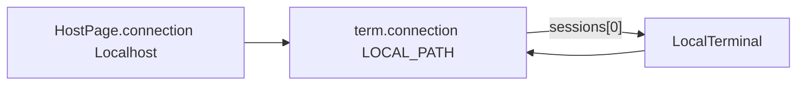

# 0.7 — Localhost child Connection is the terminal’s connection (drop sync_paths)

**Status:** ✔️ agent implemented (awaiting user verify)

**Pointer:** `docs/guide-to-writing-plans.md` — **Checklist for plans**; Vala via **`docs/coding-standards-router.md`**. Build: **`docs/build-rules.md`**.

**ℹ️** Follows cwd / {@link TerminalStream} work in chat; Localhost path children from **`docs/plans/0.3-session-states-history-guake.md`**.

**ℹ️** Proposed Vala must pass the **Verify proposed Vala code** checklist in the guide (earlier drafts of this plan did not).

---

## Purpose

- **🔷** ✔️ Avoid `HostPage` hunting / reconciling Localhost child `Connection` rows by parallel index with `terminals[]` (`sync_paths` style) — user: suspicious / bad design.
- **🔷** ✔️ Remove {@link Terminal.update_cwd} — user: does not justify a helper; inline at call sites.
- **🔷** ✔️ That tree child is **just the connection** — do not invent a second field (`path` / `tree_row`). Use {@link Terminal.connection} for the local shell’s `LOCAL_PATH` row.
- **🚫** Field named `path` (or similar) meaning a `Connection` — user: unreadable / not understandable.
- **🚫** New helpers (`ensure_path`, `sync_*`, `update_cwd`, …).

---

## What “the connection” is (local vs SSH)

- **ℹ️** SSH: `term.connection` = the host row (as today).
- **🔷** Local: `term.connection` = the **child under Localhost** (`ConnectionKind.LOCAL_PATH`), whose `name` is the cwd label in the tree. Parent is Localhost (`term.connection.parent`).
- **ℹ️** {@link HostPage}.`connection` stays **Localhost** (page key / tab strip for all local shells).
- **ℹ️** Filesystem cwd string remains {@link Terminal.cwd} — separate from the Connection object.



---

## Current behaviour

- **ℹ️** Local tabs also set `term.connection` to **Localhost**, then `sync_paths` invents parallel child rows + `local_tab` index.
- **ℹ️** {@link MainWindow} / {@link HostTreeMenu} use `conn.local_tab` → `get_nth_page`.
- **ℹ️** {@link Terminal.update_cwd} wraps two lines.

---

## Proposed behaviour

- **💩** On local tab add: create `LOCAL_PATH` Connection, set `term.connection` to it, append under Localhost, put terminal on that row’s `sessions`.
- **💩** On `label_changed`: set `term.connection.name` from `term.label()` when kind is `LOCAL_PATH`.
- **💩** On close: `tree.remove(term.connection)` for `LOCAL_PATH`.
- **💩** Focus / close: clicked `conn` is that row; terminal from `conn.sessions`; drop `local_tab`.
- **🔷** Inline cwd updates (no `update_cwd`).
- **💩** `TerminalStream` `/proc` gate: `kind == LOCAL_PATH` (not `LOCAL`).

---

## Coding-standards notes for this plan’s Vala

- **🚫** Trivial aliases (`var localhost = this.connection`) — use `this.connection` (HostPage’s Localhost) directly.
- **🚫** Defensive `term == null` / `parent == null` when invariants say LOCAL_PATH always has parent + one session — fix callers if broken.
- **ℹ️** `as HostPage` can be null (GTK lookup miss) — existing MainWindow pattern; keep only that boundary check.
- **🚫** Gratuitous break of short `&&` conditions — keep on one line when the file does.
- **🚫** New methods.

---

## 1. Drop `update_cwd`

### 1.1 `src/Terminal.vala` — remove method

**Why:** **🔷** User: helper not justified.

#### Remove

```vala
		public void update_cwd(string path)
		{
			if (path.length == 0 || path == this.cwd) {
				return;
			}
			this.cwd = path;
			this.label_changed();
		}
```

### 1.2 Call sites — inline

**Where:** {@link TerminalStream}; {@link LocalTerminal.spawn}.

#### Replace with (pattern)

```vala
			if (dir.length > 0 && dir != this.session.cwd) {
				this.session.cwd = dir;
				this.session.label_changed();
			}
```

---

## 2. No extra field — local `connection` is the child row

**🔷** User: it’s just the connection.

### 2.1 `src/Connection.vala` — remove `local_tab`

#### Remove

```vala
		public int local_tab { get; set; default = -1; }
```

### 2.2 `HostPage.add` — create child, point `term.connection` at it

**Where:** after tab title wiring, when `this.connection.kind == ConnectionKind.LOCAL`.

#### Add

```vala
			if (this.connection.kind == ConnectionKind.LOCAL) {
				var row = new Connection() {
					uuid = GLib.Uuid.string_random(),
					name = term.label(),
					kind = ConnectionKind.LOCAL_PATH
				};
				term.connection = row;
				row.sessions.append(term);
				this.tree.append(this.connection, row);
			}
```

**ℹ️** `this.connection` here is HostPage’s Localhost (unchanged). Do not alias it.

**💩** Whether Localhost `sessions` still lists every local term (parent marks) vs only child rows — match current tree UX when implementing.

### 2.3 `label_changed`

#### Replace with

```vala
			term.label_changed.connect(() => {
				var tab = this.tab_view.get_page(term);
				var text = term.label();
				tab.tooltip = text;
				tab.title = text;
				if (term.connection.kind == ConnectionKind.LOCAL_PATH && term.connection.name != text) {
					term.connection.name = text;
				}
				this.changed();
			});
```

### 2.4 `close_page`

#### Replace path-list cleanup with

```vala
				if (term.connection.kind == ConnectionKind.LOCAL_PATH) {
					term.connection.sessions.remove_all();
					this.tree.remove(term.connection);
				}
```

### 2.5 Drop `paths` + `sync_paths`

#### Remove

- `HostPage.paths`
- `sync_paths()` and all call sites

---

## 3. Focus / close by terminal on that Connection

**💩** Inline at MainWindow / HostTreeMenu LOCAL_PATH sites (**🚫** no new method).

#### Replace with (pattern)

```vala
				var term = (Terminal) conn.sessions.get_item(0);
				var local_page = this.host_stack.pages.get_child_by_name(conn.parent.uuid) as HostPage;
				if (local_page == null) {
					return;
				}
				this.host_stack.pages.visible_child = local_page;
				local_page.tab_view.selected_page = local_page.tab_view.get_page(term);
```

**ℹ️** `conn.parent` is required for `LOCAL_PATH` (set at `tree.append`). No parent null-check.
**ℹ️** Session list non-empty is required while the row exists. No `term == null` guard.

---

## 4. Stream / open_local fallout

- **💩** `⏳` {@link TerminalStream}`on_cwd`: `kind == ConnectionKind.LOCAL_PATH`.
- **💩** `⏳` Call sites that assumed local `term.connection.kind == LOCAL` — use `HostPage.connection` for Localhost; term holds the child.
- **ℹ️** Double-click new shell here: `open_local(conn.parent, conn.name)` unchanged.

---

## Suggested order

1. §1 drop `update_cwd` (**🔷**)
2. §2–§3 connection = child row; drop sync
3. §4 stream / kind checks
4. `ninja -C build`

---

## Acceptance

- **🔷** ✔️ No parallel-index `sync_paths` hunt
- **🔷** ✔️ No `update_cwd`
- **🔷** ✔️ No second field for the tree child — local tab’s `connection` is that row
- **💩** ✔️ `cd` renames `term.connection.name`
- **💩** ✔️ Close removes that tree row
- **💩** ✔️ Click child focuses same VTE via `sessions`
- **💩** ✔️ No `local_tab` / `HostPage.paths`
