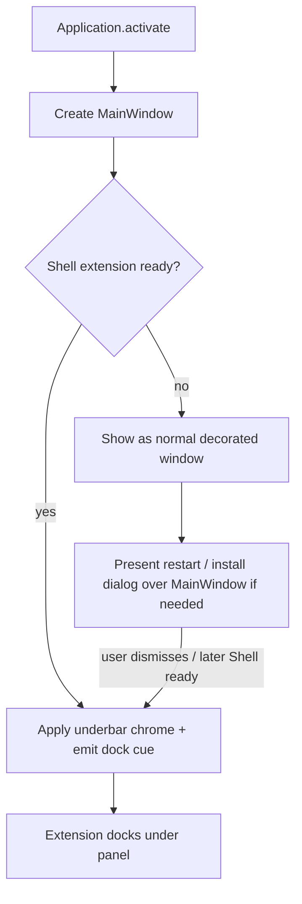

# 0.8 — Startup flow: normal window → underbar (no holder dialog)

**Status:** ✔️ agent implemented Phases 1–4 (awaiting user verify)

**Pointer:** `docs/guide-to-writing-plans.md` — **Checklist for plans**; Vala via **`docs/coding-standards-router.md`**. Build: **`docs/build-rules.md`**.

**ℹ️** Builds on Guake / Shell work in **`docs/plans/0.3-session-states-history-guake.md`** (Phases 15a–15c): `GnomeShell.ensure`, `DBus.shown`, extension `dockWindow`.

---

## Purpose

- **🔷** Drop the temporary **holder** window / dialog used only so “restart Shell / extension not ready” alerts have a parent.
- **🔷** On first show when Shell is **not** ready: present the **real** {@link MainWindow} at a **vaguely normal size**, with a **window border / decorations**, then present any setup / restart dialog **over that** window.
- **🔷** When Shell **is** ready (or becomes ready): switch that same window into the **underbar** drop-down layout (undecorated, docked under the top panel via the extension).
- **🔷** Work out the **GNOME Shell** side of that switch — when the extension may dock / remorph the window, and when it must leave it alone as a normal app window.
- **🚫** Separate throwaway `Gtk.Window` as dialog parent when the main window already exists or is about to.
- **🚫** Second permanent “setup app” UI beside the drop-down.
- **🚫** Splash / 1×1 hidden host `ApplicationWindow` then create {@link MainWindow} in an `ensure` callback (other-branch experiment; not this plan — real {@link MainWindow} is the only parent).

---

## Current behaviour

- **ℹ️** {@link Application} activate: create + `present` {@link MainWindow}, then `new GnomeShell(window).ensure(() => {})`.
- **ℹ️** {@link MainWindow} chrome from {@link GnomeShell}.`is_ready` → `is_docked` (decorated 960×640 vs undecorated drop-down percents).
- **ℹ️** {@link GnomeShell.ensure}: install/upgrade/enable; restart / fail hints via `alert()` → `Adw.AlertDialog` on that {@link MainWindow}.
- **ℹ️** Extension docks only when D-Bus `DockMode` is true (reads `is_docked`).
- **ℹ️** `--toggle-key` is settings-only (no window / no throwaway parent).

---

## Proposed behaviour

### Modes (same window)

- **🔷** **Normal mode** (setup / Shell not ready):
  - Decorated (`decorated: true`)
  - Fixed default size **960×640** (not a monitor percent — large office monitors make 50% unusable)
  - Resizable allowed in this mode
  - Extension **must not** force under-panel geometry (`DockMode` false)
  - Dialogs parented on this {@link MainWindow}
- **🔷** **Underbar mode** (Shell ready):
  - Undecorated, non-resizable (today’s drop-down chrome)
  - Percent geometry from {@link Config}
  - `DockMode` true; extension docks under the panel
- **🔷** One {@link MainWindow} instance; mode is a state change, not a second window class.

### When is Shell “ready”?

- **🔷** Ready: Shell reports the extension **enabled** **and** `GetExtensionInfo` **version** ≥ bundled `metadata.json` version (running code, not only files on disk).
- **🔷** Not ready: missing, not known to Shell, not enabled, or Shell still running an older version after an on-disk upgrade (typical Wayland until session restart).
- **🔷** `GnomeShell.ensure` still installs / enables / explains restart; on-disk update alone does not count as ready.
- **ℹ️** Shell sends `state` / `version` as doubles over D-Bus — look up with `"d"`, not `"i"`.

### Transition normal → underbar

- **🔷** On `activate` / `toggle`, re-check Shell ready; if ready and still in normal mode, remorph to underbar.
- **🔷** Remorph:
  - `decorated = false`, drop-down size percents, `drop-down` CSS as today
  - set D-Bus `DockMode` true; cue dock (`DBus.shown` or equivalent)
- **🔷** If still not ready after dialog dismiss: stay in normal mode for that process run (usable app; media-keys `--toggle` still works).

### GNOME Shell contract

- **🔷** D-Bus property **`DockMode`** (boolean) on `org.roojs.RooTerm.DBus`.
  - `false` → normal/setup: extension **must not** `move_resize_frame` / under-panel remorph
  - `true` → underbar: extension docks as today
- **🔷** Extension reads `DockMode` before `dockWindow` work; bump extension `metadata.json` `version` so {@link GnomeShell.ensure} upgrades.
- **🚫** Docking every `map` of any RooTerm window while `DockMode` is false.
- **ℹ️** Today `dockWindow` always remorphs matching app id / wm class — that is the bug for setup UX.

### Dialogs

- **🔷** Restart / install-failure / “Shell does not know extension yet” → `Adw.AlertDialog` on the **real** {@link MainWindow} in normal mode.
- **🚫** Custom `Gtk.Window` hint dialogs.
- **🚫** Invisible / empty throwaway parent solely for `present()`.
- **🚫** Splash `Adw.Dialog` + hidden host window as ensure parent.

### `--toggle-key`

- **ℹ️** `ensure_toggle_binding` is **settings-only** (gsettings); it never needed a parent window.
- **🔷** Remove the throwaway `Gtk.Window` from the `--toggle-key` path entirely.
- **ℹ️** Plain `rooterm` / `--toggle` already goes through `activate` / `DBus.toggle` and owns {@link MainWindow}. `--toggle-key` alone can stay a headless config write (no UI); that is not a second startup shape.
---

## Phases

### Phase 1 — Mode on MainWindow + first present

- **🔷** `✔️` {@link MainWindow} supports normal vs docked chrome via `is_docked` (decorated / size / resizable / CSS).
- **🔷** `✔️` First create path: if Shell not ready → construct / show in **normal** mode; else **docked**.
- **🔷** `✔️` Normal default size: **960×640** (fixed pixels; not Config drop-down percents).
- **🔷** `✔️` Shell readiness lives on {@link GnomeShell}.`is_ready` (not inlined in MainWindow).
- **🚫** New helper class for “holder”; mode lives on {@link MainWindow} / {@link Application} flow.

### Phase 2 — GnomeShell.ensure parents on MainWindow

- **🔷** `✔️` All ensure dialogs parent on the live {@link MainWindow} (`alert` → `Adw.AlertDialog`).
- **🔷** `✔️` Restore a clear restart hint when install/update left Shell unable to load the new code (not only `GLib.warning`).
- **🔷** `✔️` Remove throwaway `Gtk.Window` from `--toggle-key` path (`GnomeShell` window optional for settings-only).
- **🔷** `✔️` Drop splash / hidden-host startup from the other branch — {@link MainWindow} is created and presented first.

### Phase 3 — Extension: dock only when `DockMode`

- **🔷** `✔️` Add D-Bus property `DockMode` (bool set from {@link MainWindow}.`is_docked` at create).
- **🔷** `✔️` Extension skips under-panel remorph when `DockMode` is false; bump extension `version` to **9**.
- **🔷** `✔️` Underbar path still docks on Toggle / `Shown` when `DockMode` is true (`shown` only emitted when docked).

### Phase 4 — Remorph when Shell becomes ready

- **🔷** `✔️` On activate / toggle (and after `ensure` dialog path): if Shell ready and window still normal → underbar + `DockMode` true + `shown` dock cue.
- **💩** `⏳` Manual check notes: fresh user dir → normal + `Adw.AlertDialog`; after logout/login or X11 `Alt+F2` `r` without quitting app → next toggle remorphs to underbar.
---

## Suggested order

1. Phase 1 — MainWindow modes + first present branch
2. Phase 2 — ensure dialogs on real window; kill throwaway parent
3. Phase 3 — extension dock gate
4. Phase 4 — remorph normal → underbar

---

## LLM notes

- **ℹ️** GTK4 cannot position/keep-above itself; underbar geometry stays Shell-owned (`extension.js` `dockWindow`).
- **ℹ️** Wayland often needs session restart before Shell loads a newly installed extension — normal mode is the usable first-run chrome until then.
- **🚫** Do not add helpers unless Phase text explicitly names them; prefer branching in existing `MainWindow` ctor / `Application.activate` / `GnomeShell.ensure` / `dockWindow`.
- **ℹ️** Normal-mode size locked: **960×640** (user: percent of large office monitors is too big).
