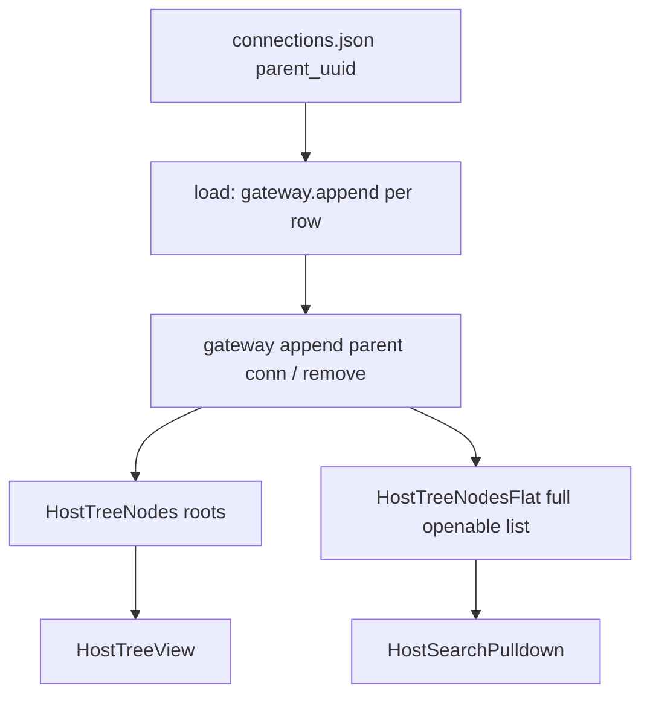

# 0.4 — HostTreeView + HostTreeNodes (GListModel tree)

**Status:** DONE

**Pointer:** `docs/guide-to-writing-plans.md` — **Checklist for plans**; Vala via **`docs/coding-standards-router.md`**. Build: **`docs/build-rules.md`**.

**ℹ️** Builds on **`docs/plans/done/0.3-DONE-session-states-history-guake.md`**. Gateway + nest + flat search shipped.
**ℹ️** Follow-on chrome (add group, DnD, LXC console/attach) → **`docs/plans/0.9-wishlist.md`**. VTE right-click → **`0.11-DONE-vte-context-menu.md`**.

---

## Purpose

- **🔷** Stop rebuilding the left host tree (and search list) with **`fill()`** on every add / edit / delete / LXC discover.
- **🔷** Nested **`HostTreeNodes`** of **`Connection`**; live **`parent`** set on place.
- **🔷** **Single gateway** for append/remove: updates **nested tree + flat search list** together.
- **🔷** Widget rename: today’s **`HostTree`** → **`HostTreeView`**.
- **ℹ️** Tree DnD / add group / LXC console·attach → **0.9** (not blocking this plan).

---

## Architecture roadmap (gateway: nest + flat)

Current pain: reactive Flat (watch every nest / bubble / mirrors) is messy; deserialize is flat JSON with no live parent until we nest.

### Rejected / avoid

- **🚫** Flat owns a watch-graph over all nested `HostTreeNodes`.
- **🚫** Bubble-up signal graph so Flat can reverse-engineer mutates (previous option — drop).
- **🚫** Clear-and-rebuild flat on any change.
- **🚫** Separate `HostTreeNode` wrapper type.
- **🚫** Changing `Connection.name` to include the parent for search.
- **🚫** Calling `children.append` / `roots.append` from random call sites without going through the gateway (that skips flat).

### Chosen shape — gateway keeps two lists

One entry point owns nesting **and** the flat search model. Callers always **append/remove with parent**; never poke nested lists or flat separately.

**1. Gateway (single mutate API)**

- Lives on **`HostTreeNodes`** (`Config.tree` is the root list).
- **`append(Connection? parent, Connection conn)`**
  - `parent == null` → `roots.append(conn)`; else `parent.children.append(conn)`.
  - Sets live **`conn.parent`**, **`conn.parent_uuid`**.
  - If openable (!group && !deleted): add to **`flat`** (sorted); emit flat `items-changed`.
  - Wire `conn.children` ownership as needed for the nest.
- **`remove(Connection conn)`**
  - Detach from `conn.parent.children` or this root list (via live `parent`).
  - Clear live parent; remove from **`flat`**.
- Load, LXC discover, dialogs, DnD **only** call these — **🚫** bypass.

**2. Two lists, one write path**

| List | Type | Role |
| ---- | ---- | ---- |
| Nested | **`HostTreeNodes`** (root = `Config.tree`; each `Connection.children`) | Tree view / `TreeListModel` |
| Flat | **`HostTreeNodesFlat`** (`Config.tree.flat`) | Search; full openable set maintained by gateway |

- Flat is **not** a reactive wrapper over the nest. It is the **second list the gateway updates**.
- Flat still implements `GListModel` for `FilterListModel`; it does **not** listen to nested `items-changed`.

**3. `Connection` is the node**

- `parent_uuid` for JSON; live **`parent`** (not serialized) set only by gateway append/remove.
- `children` = `HostTreeNodes`.
- Tree label = `name`; search label = parent-prefixed when `parent` is set (container under host).

**4. Load from config**

1. Deserialize flat rows → `by_uuid` (empty `children` each).
2. `roots` is `HostTreeNodes`; `flat` starts empty.
3. For each conn (parents before children, or any order if parent already in `by_uuid`):  
   `gateway.append(parent_or_null, conn)`.
4. That one path nests the tree **and** fills flat.

**5. View / search**

- `HostTreeView`: root = `Config.tree`; `create_func` → `connection.children`.
- `HostSearchPulldown`: model = `Config.tree.flat`; filter uses search display string (parent + name).

### Why this is cleaner than bubble

- No symbiotic signal cascade between every `HostTreeNodes`.
- Flat never re-derives structure; gateway already knows what was added/removed.
- Deserialize problem solved: **append(parent, conn)** is the only place parent + both lists are attached.

### Roadmap

| Step | What | Done when |
| ---- | ---- | --------- |
| **A** | Gateway `append` / `remove` on Config (or named model); `Connection.parent`; `roots` + `flat` fields | Mutate updates nest + flat |
| **B** | Load uses only gateway append | Restart nests + search list without `fill` |
| **C** | `HostTreeView` on `roots`; drop tree refresh-`fill` | Live tree |
| **D** | Pulldown on `flat`; parent-prefixed search label; drop search `fill` | Live search |
| **E** | DnD / add group / console-attach via gateway | Chrome |

**ℹ️** Draft `HostTreeNodesFlat` that watches nested lists is **obsolete** under this shape — Flat becomes gateway-owned storage + `GListModel`, not a listener.

---

## Naming

| Role | Type | Notes |
| ---- | ---- | ----- |
| Gateway | **`HostTreeNodes`** (root) | Same type as nested lists; root also has `flat`; `append(parent,conn)` / `remove(conn)` |
| Widget | **`HostTreeView`** | Rename from `HostTree` |
| Nested list | **`HostTreeNodes`** | `GListModel` + ArrayList; root + `children` |
| Node | **`Connection`** | live `parent`; `parent_uuid` in JSON |
| Flat list | **`HostTreeNodesFlat`** | `GListModel` of openable hosts; **written by gateway only** |

**🚫** `HostTreeNode` wrapper class. **🚫** Separate `HostTreeModel` / `roots` store.

---

## Follow-on chrome → **0.9**

- **ℹ️** Tree DnD, add/edit group, LXC **console** / **attach** context menu — moved to **`docs/plans/0.9-wishlist.md`** so this plan can close.
- **🚫** Edit connection on LXC rows (delete-only for now — still true).

---

## Class / file list

- **`HostTreeNodes`** — list + (on root) `flat` + gateway `append` / `remove`.
- **`Config`** — JSON / `by_uuid`; holds `tree` (`HostTreeNodes`).
- **`Connection`** — node; `children`; live `parent`.
- **`HostTreeNodesFlat`** — flat ListModel; gateway mutates it.
- **`HostTreeView`** / **`HostSearchPulldown`** — consume `tree` / `tree.flat`.
- **`meson.build`** — sources; rename view file.

---

## Phases

### Phase 17 — Gateway + nest + view (A–C)

- **🔷** `✅` `HostTreeNodes` gateway `append` / `remove`; `Connection.parent`; `Config.tree`.
- **🔷** `✅` Load only through gateway.
- **🔷** `✅` `HostTree` on live `roots`; no tree `fill`-as-refresh.

### Phase 18 — Search on flat (D)

- **🔷** `✅` Pulldown uses `flat`; parent-prefixed label/filter; no search `fill`.
- **🔷** `✅` Slim/rewrite `HostTreeNodesFlat` as gateway-owned list (no nest watchers).

### Phase 19 — Chrome (E) → **0.9**

- **ℹ️** Add group / console-attach / tree DnD → **`docs/plans/0.9-wishlist.md`**.

---

## Suggested order (historical)

1. Phase 17 — gateway + load + view — `✅`
2. Phase 18 — search on flat — `✅`
3. Phase 19 — → **0.9**

---

## Open confirms

- **💩** Field rename `MainWindow.host_tree` → `host_tree_view` vs keep the field name.
- **💩** DnD: drop onto **groups only**, or also onto hosts?
- **💩** Search separator (`" / "` vs `" - "`).

---

## LLM notes

- Implement only **🔷** after approval; promote **💩** explicitly.
- **🚫** Bypass gateway (direct `children.append` that skips flat).
- **🚫** Flat watching nested lists / bubble graph / clear-and-rebuild flat.
- **🚫** `HostTreeNode` type; **🚫** `fill()`-as-refresh.
- **🚫** Expect / RDP / Ásbrú write-back.
- Vala: router → standards → `ninja -C build` only.
- Prefer named types above; gateway `append` / `remove` are the approved mutate entry points.

---

## Relation to 0.3 / 0.9

- LXC **discover parse** / sudo / key setup stay in **0.3** (DONE).
- **Host tree editing** (DnD, add group) and **console/attach** → **0.9**.
- 0.3 Phase **13b** pointed at this plan (gateway work — done).
